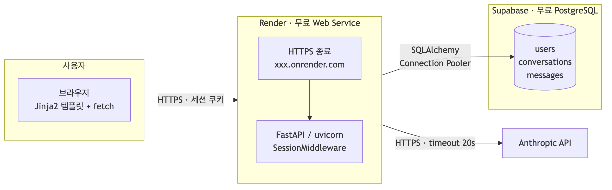
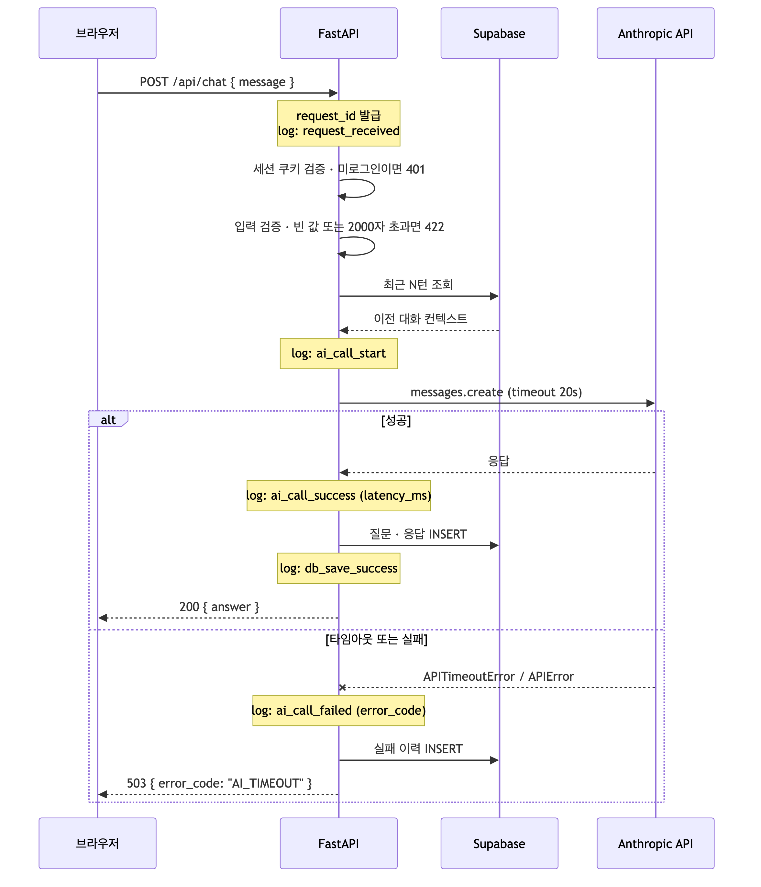
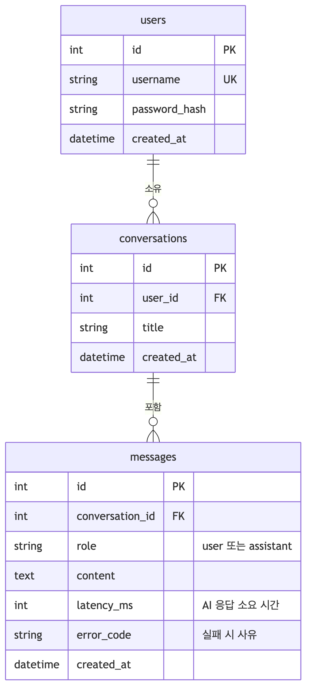

# AI 챗봇 서비스

**배포 주소 — https://chatbot-api-xihh.onrender.com**

> 무료 플랜이라 15분 이상 요청이 없으면 대기 상태로 들어간다.
> 첫 접속은 깨어나는 데 1분쯤 걸릴 수 있다.

로그인한 사용자가 웹에서 질문하면 AI 가 답하고, 모든 대화가 DB 에 누적되는 서비스다.
대화별로 문맥이 이어지며, 지난 대화를 언제든 다시 열어볼 수 있다.

- **문제 정의** — 일반 챗봇 UI 는 대화가 길어지면 문맥이 끊기거나 비용이 급증한다.
  또한 대화 기록이 브라우저에만 남아 다른 기기에서 이어가기 어렵다.
- **타겟 사용자** — 여러 주제를 오가며 AI 와 길게 대화하고, 지난 논의를 다시 찾아봐야 하는 사용자.
- **핵심 시나리오**
  1. 회원가입 후 로그인한다.
  2. 새 대화를 열고 질문한다. AI 가 답한다.
  3. 대화가 길어지면 오래된 내용은 자동으로 요약되고 최근 맥락은 유지된다.
  4. 며칠 뒤 다시 접속해 그 대화를 열면 이전 내용이 그대로 복구된다.

---

## 기술 스택

| 영역 | 사용 기술 |
|---|---|
| 백엔드 | FastAPI (async), uvicorn |
| 프론트엔드 | Jinja2 템플릿 + Vanilla JS |
| AI | LangGraph `create_agent` + `SummarizationMiddleware` |
| 인증 | Supabase Auth + HttpOnly 쿠키 |
| DB | Supabase PostgreSQL |
| 배포 | Render |

---

## 로컬 실행 방법

### 1. 저장소 클론 및 의존성 설치

```bash
git clone https://github.com/codyssey-ai/chatbot-api.git
cd chatbot-api

python3 -m venv .venv
source .venv/bin/activate          # Windows: .venv\Scripts\activate
pip install -r requirements.txt
```

Python 3.11 이상이 필요하다.

### 2. 환경 변수 설정

```bash
cp .env.example .env
```

`.env` 를 열어 아래 값을 채운다. **`.env` 는 저장소에 올라가지 않는다.**

| 키 | 필수 | 발급 위치 |
|---|:--:|---|
| `OPENAI_API_KEY` | O | [platform.openai.com](https://platform.openai.com/api-keys) |
| `MODEL_NAME` | | 기본값 `openai:gpt-4.1-mini` |
| `DATABASE_URL` | O | Supabase → **Connect** → `Direct` 탭 → **Session pooler** |
| `SUPABASE_URL` | O | Supabase → Settings → API Keys |
| `SUPABASE_ANON_KEY` | O | 같은 화면의 Publishable key (`sb_publishable_...`) |
| `SUPABASE_SERVICE_ROLE_KEY` | | 현재 사용처 없음. 비워 둔다 |
| `AI_TIMEOUT_SECONDS` | | 기본값 60 |
| `SUMMARY_TRIGGER_TOKENS` | | 요약 시작 임계값. 기본값 8000 |
| `SUMMARY_KEEP_TOKENS` | | 원문 유지 토큰. 기본값 4000 |
| `MAX_MESSAGE_LENGTH` | | 입력 길이 제한. 기본값 2000 |
| `COOKIE_SECURE` | | 로컬은 `false`, 배포(HTTPS)는 `true` |
| `LANGGRAPH_STRICT_MSGPACK` | | 체크포인트 역직렬화 타입 제한. `true` 로 둔다 |
| `LOG_LEVEL` | | 기본값 `INFO` |

`DATABASE_URL` 에서 주의할 점이 두 가지 있다.

- **반드시 Session pooler(5432)를 쓴다.** Transaction pooler(6543)는 prepared statement 를
  지원하지 않아 LangGraph 체크포인터에서 간헐적 오류가 난다.
- 비밀번호에 특수문자가 있으면 URL 인코딩한다. 예: `!` → `%21`

### 3. 데이터베이스 준비

Supabase 대시보드 → **SQL Editor** 에서 [`scripts/schema.sql`](scripts/schema.sql) 전체를
붙여넣고 실행한다. 여러 번 실행해도 안전하다.

이어서 **Authentication → Sign In / Providers → Email** 에서
**Confirm email 을 끈다.** 켜져 있으면 회원가입 테스트마다 메일 확인이 필요하다.

> LangGraph 체크포인트 테이블(`checkpoints` 등)은 직접 만들지 않는다.
> 서버가 처음 기동될 때 자동으로 생성된다.

### 4. 서버 실행

```bash
uvicorn app.main:app --reload
```

기동에 성공하면 아래 로그가 나온다.

```
INFO  startup_complete request_id=- model=openai:gpt-4.1-mini
INFO: Application startup complete.
INFO: Uvicorn running on http://127.0.0.1:8000
```

### 5. 동작 확인

```bash
curl -s localhost:8000/health
# {"status":"ok"}
```

브라우저에서 http://localhost:8000 을 열면 로그인 화면으로 이동한다.

미로그인 상태에서 API 를 호출하면 차단되는지도 확인할 수 있다.

```bash
curl -i -X POST localhost:8000/api/threads \
  -H 'Content-Type: application/json' -d '{}'
# HTTP/1.1 401 Unauthorized
# {"error_code":"UNAUTHORIZED","message":"로그인이 필요합니다.","request_id":"..."}
```

### 문제가 생기면

| 증상 | 원인과 해결 |
|---|---|
| `Missing credentials` 로 기동 실패 | `.env` 의 `OPENAI_API_KEY` 가 비어 있다 |
| `ValidationError` 로 기동 실패 | 필수 환경 변수가 빠졌다. 위 표의 **필수** 항목을 확인한다 |
| DB 연결 타임아웃 | `DATABASE_URL` 이 Session pooler 주소인지, 비밀번호가 인코딩됐는지 확인한다 |
| 가입은 되는데 로그인이 안 됨 | Supabase → Authentication → Sign In / Providers → Email 에서 **Confirm email 을 끈다** |
| 로그인 후 계속 `/login` 으로 돌아감 | 로컬은 HTTP 라 `COOKIE_SECURE=false` 여야 쿠키가 심긴다 |

---

## 프로젝트 구조

기능별로 폴더를 나눠 담당자가 폴더 단위로 소유할 수 있게 했다.
한 기능을 고칠 때 그 폴더 안에서 끝나므로 여러 명이 동시에 작업해도 충돌이 적다.

```
app/
├─ main.py        진입점. lifespan 에서 풀·체크포인터·에이전트를 조립한다
├─ core/          설정, DB 풀, 로깅, 미들웨어, 예외, 전역 의존성
├─ auth/          회원가입·로그인·토큰 검증
├─ threads/       채팅방 CRUD
├─ chat/          메시지 전송, LangGraph 에이전트, 프롬프트
└─ web/           Jinja2 화면 라우터

templates/        base / login / signup / chat
static/           style.css, chat.js
scripts/          schema.sql, check_logs.sql, render-diagrams.sh
docs/             architecture.md, API_SPEC.md, 다이어그램
```

각 기능 폴더는 같은 역할 구분을 따른다.

| 파일 | 역할 |
|---|---|
| `router.py` | HTTP 계층. 요청을 받고 응답을 만든다 |
| `schemas.py` | 요청/응답 모델과 입력 검증 |
| `service.py` | 비즈니스 로직. 소유권 확인 등 여러 단계를 조립한다 |
| `repository.py` | SQL. DB 접근은 이 파일에만 둔다 |
| `deps.py` | 해당 기능의 의존성 |

## 시스템 구조



| 컴포넌트 | 역할 |
|---|---|
| 브라우저 (Jinja2 + JS) | 회원가입·로그인 폼, 채팅 화면 |
| 인증 라우터 | Supabase Auth 호출 후 토큰을 HttpOnly 쿠키로 발급 |
| `get_current_user` | 쿠키 토큰 검증. 비로그인 요청 401 차단 |
| 챗 라우터 | 입력 검증 → LangGraph 호출 → 응답 반환 → `chat_logs` 저장 |
| LangGraph Agent | 현재 질문만 받아 처리. 과거 대화는 체크포인터가 복구 |
| `SummarizationMiddleware` | 토큰 임계값 초과 시 과거 대화를 요약으로 압축 |
| `AsyncPostgresSaver` | `thread_id` 기준 State 저장·복구 |

**AI API 키는 서버에서만 사용한다.** 브라우저는 우리 FastAPI 만 호출하고,
OpenAI 호출과 Supabase 접속은 전부 서버 안에서 일어난다.

자세한 내용은 [`docs/architecture.md`](docs/architecture.md) 참고.

### 인증 방식 — 왜 서버 세션이 아니라 토큰인가

세 가지를 두고 골랐다.

| 방식 | 서버가 보관하는 것 | 문제 |
|---|---|---|
| 서버 세션 (`SessionMiddleware`) | 세션 저장소 | 프로세스 메모리에 두면 **재배포마다 전원 로그아웃**된다. 무료 플랜은 15분 무활동이면 spin down 되므로 사실상 매번 풀린다. Redis 를 따로 두는 건 과하다 |
| 토큰을 응답 본문으로 전달 | 없음 | JavaScript 가 토큰을 들고 있어야 해서 **XSS 에 그대로 노출**된다 |
| **토큰을 HttpOnly 쿠키로 전달** | **없음** | 채택 |

정리하면 — **자격 증명 관리는 Supabase Auth 에 위임하고, 세션 유지는 토큰으로,
토큰 보관은 브라우저 쿠키로** 한다. 서버는 아무것도 저장하지 않는다.

- 서버가 무상태라 **재배포·재시작해도 로그인이 풀리지 않는다**
- `httponly=True` 로 JavaScript 의 `document.cookie` 접근을 차단한다.
  그래서 [`static/chat.js`](static/chat.js) 에는 토큰을 다루는 코드가 한 줄도 없다
- `secure` 는 환경에 따라 갈린다. 로컬은 HTTP 라 `false`, 배포는 HTTPS 라 `true`
- `samesite="lax"` 로 다른 사이트가 보낸 요청에는 쿠키가 실리지 않게 한다
- 쿠키 수명(`max_age`)을 Supabase 가 알려준 토큰 만료 시각에 맞춰, 토큰은 죽었는데
  쿠키만 살아 있는 엇박자를 없앤다

`SessionMiddleware` 를 등록하지 않는 것도 같은 이유다. 서버에 보관할 세션이 없다.
대신 **인증 확인 로직을 `Depends` 의존성으로 분리**해
([`app/auth/deps.py`](app/auth/deps.py)) 7개 엔드포인트가 한 줄로 재사용한다.

```python
user: CurrentUser = Depends(get_current_user)
```

트레이드오프도 있다. 요청마다 Supabase 에 토큰 검증을 왕복해 **약 0.4초가 붙는다.**
단순하고 확실한 대신 지연을 택했다. 문제가 되면 공개키를 받아 서버에서 직접 검증하는
방식으로 바꿀 수 있다. 자세한 비교는 [`docs/API_SPEC.md`](docs/API_SPEC.md) 8.2 참고.

### 요청 처리 흐름



---

## API 명세

전체 명세와 요청·응답 예시는 [`docs/API_SPEC.md`](docs/API_SPEC.md) 에 있다.
서버 기동 후 http://localhost:8000/docs 에서도 확인할 수 있다.

엔드포인트는 라우터 단위로 나뉜다. 각 라우터가 책임지는 범위가 곧 폴더 경계다.

**`app/auth/router.py`** — 계정과 세션. 인증이 필요 없는 유일한 API 묶음이다.

| Method | Endpoint | 설명 | 인증 |
|---|---|---|:--:|
| `POST` | `/api/auth/signup` | 회원가입 | |
| `POST` | `/api/auth/login` | 로그인. HttpOnly 쿠키 발급 | |
| `POST` | `/api/auth/logout` | 로그아웃. 쿠키 삭제 | |
| `GET` | `/api/me` | 현재 사용자 확인 | O |

**`app/threads/router.py`** — 채팅방 CRUD. `{id}` 를 받는 요청은 소유권을 먼저 확인한다.

| Method | Endpoint | 설명 | 인증 |
|---|---|---|:--:|
| `POST` | `/api/threads` | 새 채팅 생성 | O |
| `GET` | `/api/threads` | 내 채팅 목록 | O |
| `PATCH` | `/api/threads/{id}` | 제목 변경 | O |
| `DELETE` | `/api/threads/{id}` | 채팅 삭제. 체크포인트까지 정리 | O |

**`app/chat/router.py`** — AI 파이프라인. 경로 앞부분은 `threads` 와 같지만
채팅방 CRUD 와 성격이 달라 파일을 나눴다.

| Method | Endpoint | 설명 | 인증 |
|---|---|---|:--:|
| `GET` | `/api/threads/{id}/messages` | 대화 내역 조회 | O |
| `POST` | `/api/threads/{id}/messages` | 메시지 전송 | O |

**`app/web/router.py`** — Jinja2 화면. JSON 이 아니라 HTML 을 반환한다.
쿠키 존재만 보고 분기하며, 실제 토큰 검증은 화면이 호출하는 API 가 한다.

| Method | Endpoint | 설명 |
|---|---|---|
| `GET` | `/` | 채팅 화면. 쿠키 없으면 `/login` 으로 303 |
| `GET` | `/login` | 로그인 화면 |
| `GET` | `/signup` | 회원가입 화면 |

**`app/main.py`** — 운영용.

| Method | Endpoint | 설명 | 인증 |
|---|---|---|:--:|
| `GET` | `/health` | 서버·DB 상태 확인 | |

### 공개 · 인증 필요 구분

| 구분 | 엔드포인트 |
|---|---|
| **공개** | `/`, `/login`, `/signup`, `POST /api/auth/signup`, `POST /api/auth/login`, `POST /api/auth/logout`, `GET /health` |
| **인증 필요** | 그 외 **모든 `/api`** — `Depends(get_current_user)` 가 붙는다 |

비로그인 요청은 `401 UNAUTHORIZED` 와 `"로그인이 필요합니다."` 를 받는다.

### 왜 챗봇 기능을 로그인 사용자로 제한했는가

두 가지 이유다.

1. **비용과 남용 방지.** AI 호출은 요청마다 실제 비용이 발생한다. 인증이 없으면
   누구나 무제한으로 호출할 수 있어 비용이 통제되지 않고, 사용자별 제한도 걸 수 없다.
2. **대화는 개인 데이터다.** 대화 로그를 사용자 기준으로 쌓고 조회하려면 요청 주체를
   식별해야 한다. `chat_logs.user_id` 가 없으면 "내 대화" 라는 개념 자체가 성립하지 않는다.

그래서 모든 채팅 관련 API 에 `Depends(get_current_user)` 를 걸고, 조회·수정·삭제는
**소유권까지** 확인한다. 타인 소유 리소스에는 403 이 아니라 404 를 준다.
403 은 "그 ID 의 자원이 존재한다" 는 사실을 알려주는 셈이기 때문이다.

### API 스키마 변경 정책

현재 버전 접두어(`/api/v1`)를 쓰지 않는다. 클라이언트가 같은 저장소의 브라우저
화면 하나뿐이라, 서버와 프론트가 항상 같은 커밋으로 배포되기 때문이다.

스키마를 바꿀 때는 아래를 따른다.

| 변경 | 취급 | 절차 |
|---|---|---|
| 응답에 필드 **추가** | 호환 | 그대로 배포. 기존 클라이언트는 무시한다 |
| 선택 필드(기본값 있음) **추가** | 호환 | 그대로 배포 |
| 필드 **삭제 · 이름 변경 · 타입 변경** | 비호환 | `docs/API_SPEC.md` 갱신 + 프론트 동시 수정 |
| 엔드포인트 **삭제 · 경로 변경** | 비호환 | 같은 PR 에서 프론트까지 고친다 |

비호환 변경은 **서버와 프론트를 같은 PR 로 묶는다.** 외부 클라이언트가 생기면
그때 `/api/v1` 접두어를 도입하고 이 정책을 버전 정책으로 바꾼다.

### 예시 — 메시지 전송

```http
POST /api/threads/5aa60fa8-c927-4416-b559-f9661b7df00f/messages
Content-Type: application/json

{ "message": "내가 아까 DB 뭐 쓴다고 했지?" }
```

```json
{
  "thread_id": "5aa60fa8-c927-4416-b559-f9661b7df00f",
  "answer": "Supabase PostgreSQL 을 사용한다고 하셨습니다."
}
```

### 오류 응답

| 상황 | 코드 | `error_code` |
|---|:--:|---|
| 미로그인 | 401 | `UNAUTHORIZED` |
| 타인 소유 리소스 | 404 | `NOT_FOUND` |
| 입력 검증 실패 | 422 | `INVALID_INPUT` |
| AI 호출 타임아웃 | 504 | `AI_TIMEOUT` |
| AI 호출 실패 | 502 | `AI_UPSTREAM_ERROR` |

모든 응답에 `request_id` 가 포함되며 서버 로그와 대조할 수 있다.
오류 원문은 사용자에게 노출하지 않고 로그와 `chat_logs.error_message` 에만 남긴다.

---

## DB 구조



| 테이블 | 역할 |
|---|---|
| `auth.users` | 사용자 계정. **Supabase Auth 가 관리** (직접 만들지 않음) |
| `chat_threads` | 사용자별 채팅방. `id` 가 LangGraph `thread_id` 로 쓰인다 |
| `chat_logs` | 질문·응답 원본. 화면 복구·조회·감사용 |
| `checkpoints` 계열 | LangGraph Agent State. 자동 생성·관리 |

`chat_logs` 는 컨텍스트 관리용이 아니다. 미들웨어가 오래된 대화를 요약해도
`chat_logs` 의 원본은 그대로 유지된다.

대화를 한 테이블(`conversations`)에 담지 않고 둘로 나눈 이유는, 사용자가 여러
대화방을 오갈 수 있어야 하고 LangGraph 가 대화 단위 식별자를 요구하기 때문이다.
일반적인 `conversations` 설계와 대응시키면 아래와 같다.

| 흔한 이름 | 이 프로젝트 | 비고 |
|---|---|---|
| `conversations` | `chat_threads` | 대화방 1건. `id` 가 LangGraph `thread_id` |
| `messages` / `chat_logs` | `chat_logs` | 질문·응답 1쌍. `thread_id` 로 묶인다 |

### DB 확인 가이드

두 가지 방법을 제공한다. **SQL 스크립트**가 가장 빠르고, **API** 는 로그인 상태에서
화면으로도 확인할 수 있다.

#### 방법 1 — SQL 스크립트 (권장)

SQLite 가 아니라 Supabase PostgreSQL 을 쓰므로 파일 경로 대신 대시보드로 접속한다.

1. [supabase.com](https://supabase.com) 로그인 → 해당 프로젝트 선택
2. 왼쪽 사이드바 **SQL Editor** → **New query**
3. [`scripts/check_logs.sql`](scripts/check_logs.sql) 의 내용을 붙여넣고
   **쿼리 블록을 하나씩** 선택해 `Ctrl/Cmd + Enter` 로 실행

| # | 쿼리 | 확인 내용 |
|---|---|---|
| 1 | 최근 대화 로그 20건 | 질문·응답·생성 시각·사용자 이메일 |
| 2 | 사용자별 누적 현황 | 스레드 수, 메시지 수, 실패 수, 평균 지연 |
| 3 | 특정 사용자 대화 전체 | 59행의 이메일을 바꿔 실행 |
| 4 | 실패한 호출 | AI 타임아웃·오류가 `error_message` 와 함께 |
| 5 | 체크포인트 적재 | 대화 State 가 저장되고 있는지 |
| 6 | 저장 용량 | 무료 플랜 500MB 관리 |

로컬에서 `psql` 로 실행하려면 `.env` 의 `DATABASE_URL` 을 그대로 쓴다.

```bash
psql "$DATABASE_URL" -f scripts/check_logs.sql
```

#### 방법 2 — 로그 조회 API

로그인하면 본인 대화만 조회된다. 브라우저로 로그인한 뒤 개발자도구
**Application → Cookies** 에서 `access_token` 값을 복사해 사용한다.

```bash
BASE=https://chatbot-api-xihh.onrender.com
TOKEN=<복사한 access_token>

# 1) 내 채팅방 목록
curl -s "$BASE/api/threads" -b "access_token=$TOKEN"

# 2) 특정 채팅방의 대화 내역
curl -s "$BASE/api/threads/<thread_id>/messages" -b "access_token=$TOKEN"
```

```json
[
  {
    "id": 12,
    "question": "내가 아까 DB 뭐 쓴다고 했지?",
    "answer": "Supabase PostgreSQL 을 사용한다고 하셨습니다.",
    "status": "success",
    "created_at": "2026-09-12T02:31:07.412Z"
  }
]
```

실패한 호출은 `status` 가 `"error"` 이고 `answer` 가 `null` 이다.
채팅 화면에서 채팅방을 열면 이 API 로 이전 대화가 복구된다.

---

## 민감정보 관리

- API 키, DB 비밀번호 등은 **코드와 문서에 직접 쓰지 않는다.** 전부 `.env` 로 관리한다.
- `.env` 는 [`.gitignore`](.gitignore) 에 등록되어 저장소에 올라가지 않는다.
  DB 파일, 로그, 가상환경, 키 파일도 함께 제외한다.
- 저장소에는 [`.env.example`](.env.example) 만 포함한다. **키 이름과 설명만 있고 실제 값은 없다.**
- Supabase 접속 키는 서버에서만 사용하며 클라이언트로 내보내지 않는다.
- `chat_threads`, `chat_logs` 와 LangGraph 체크포인트 테이블에 **RLS 를 켜 두었다.**
  Supabase 는 `public` 스키마를 REST API 로 자동 노출하는데, 정책을 만들지 않은 채
  RLS 만 켜면 외부 직접 접근이 차단된다. 서버는 소유자 역할로 접속해 영향받지 않는다.

---

## 배포

배포 URL: **https://chatbot-api-xihh.onrender.com**

Render 에 GitHub 저장소를 연결한다. 빌드·시작 명령과 환경 변수 목록은
[`render.yaml`](render.yaml) 에 정의되어 있어, Blueprint 로 가져오면 그대로 재현된다.
대시보드에서 직접 설정한다면 아래와 같다.

```
Build Command      pip install -r requirements.txt
Start Command      uvicorn app.main:app --host 0.0.0.0 --port $PORT
Health Check Path  /health
```

Python 버전은 [`.python-version`](.python-version) 으로 고정한다.

### 환경 변수

`.env` 의 키를 Render 환경 변수로 등록한다. **로컬과 달라지는 값은 하나뿐이다.**

| 키 | 배포 값 |
|---|---|
| `COOKIE_SECURE` | **`true`** — Render 는 HTTPS 를 제공하므로 세션 쿠키에 Secure 를 켠다 |

비밀값(`OPENAI_API_KEY`, `GEMINI_API_KEY`, `DATABASE_URL`, `SUPABASE_URL`,
`SUPABASE_ANON_KEY`)은 `render.yaml` 에 값을 두지 않고 대시보드에서 입력한다.

### 배포 후 확인

1. `GET /health` 가 `{"status":"ok"}` 를 반환하는지
2. 기동 로그에 `startup_complete main_model=... summary_model=...` 이 찍히는지
3. Supabase → Authentication → Sign In / Providers → Email 에서 Confirm email 이 꺼져 있는지
4. 회원가입 → 로그인 → 대화 전송이 배포 환경에서 동작하는지

### 유휴 정지 주의

무료 플랜에는 유휴 정지가 있다.

| 대상 | 정지 조건 | 결과 |
|---|---|---|
| Render | 15분 무활동 | spin down. 다음 요청 시 약 1분 뒤 자동으로 깨어난다 |
| Supabase | **7일 무활동** | **프로젝트 일시정지. 앱 전체가 동작하지 않는다** |

Render 는 요청이 오면 스스로 깨어나지만, **Supabase 는 그렇지 않다.**
따라서 오래 사용하지 않았다면 **시연이나 평가 전에 서비스에 한 번 접속해 깨워 둔다.**
`/health` 를 호출하면 DB 에 `SELECT 1` 이 나가 Render 와 Supabase 가 함께 깨어난다.

```bash
curl -s https://chatbot-api-xihh.onrender.com/health
```

---

## 구현 현황

모든 기능이 구현되어 배포까지 완료되었다.

| 항목 | 상태 |
|---|---|
| 프로젝트 구조, 설정, 로깅, 예외 처리 | 완료 |
| DB 스키마, 체크포인트 테이블 RLS | 완료 |
| 인증 (회원가입 · 로그인 · 로그아웃 · 토큰 검증) | 완료 |
| 채팅방 CRUD (생성 · 목록 · 제목 변경 · 삭제) | 완료 |
| 멀티턴 메시지 전송, LangGraph 에이전트, 요약 미들웨어 | 완료 |
| 대화 로그 저장 및 조회, 실패 로그 기록 | 완료 |
| 장애 처리 (타임아웃 · 업스트림 실패 · 동시 요청 차단 · 모델 폴백) | 완료 |
| 화면 (회원가입 · 로그인 · 채팅 · 채팅방 관리) | 완료 |
| 배포 (Render) | 완료 |

---

## 팀 구성원 및 역할

| 이름 | 역할 | 커밋 |
|---|---|---|
| 정재윤 ([@whitecy01](https://github.com/whitecy01)) | API · 공통 기반 | 18 |
| 김현중 ([@stnguswnd](https://github.com/stnguswnd)) | AI 파이프라인 · 채팅 API | 14 |
| 백예지 ([@yejibaek12](https://github.com/yejibaek12)) | 프론트엔드 | 19 |

> 백예지는 작업 중 git 사용자 이름이 `bllancck` 에서 `yejibaek12` 로 바뀌어
> `git shortlog` 에는 17 + 2 로 나뉘어 표시된다. 이메일(`whyj102@gmail.com`)이
> 같아 동일인이며, 합산 19 커밋이다. 아래 명령으로 확인할 수 있다.
>
> ```bash
> git log --no-merges develop --format='%ae' | sort | uniq -c | sort -rn
> ```

### 정재윤 — API · 공통 기반

- 프로젝트 구조 설계. 기능별 패키지와 라우터 → 서비스 → 리포지토리 3계층 고정
- 설정(`pydantic-settings`), DB 커넥션 풀, 구조화 로깅, 공통 예외 처리
- 요청마다 `request_id` 를 발급해 모든 로그와 오류 응답에 싣는 미들웨어
- Supabase 스키마 작성, 체크포인트 테이블 RLS 적용
- 인증 API — 회원가입 · 로그인 · 로그아웃 · 토큰 검증. HttpOnly 쿠키 세션
- Render 배포 설정(`render.yaml`)과 기동 로그 정정
- 시스템 구조 문서, API 명세, 아키텍처 다이어그램, README

### 김현중 — AI 파이프라인 · 채팅 API

- 채팅방 CRUD API. 요청마다 소유권 확인, 삭제 시 체크포인트까지 정리
- `thread_id` 기반 멀티턴 메시지 처리. 과거 대화는 체크포인터가 복구한다
- LangGraph 에이전트 구성과 `SummarizationMiddleware` 요약 전략
- 메인 · 요약 모델 분리, OpenAI 실패 시 Gemini 자동 폴백
- 대화 로그 저장과 이력 조회. 실패도 `status='error'` 로 기록
- 장애 처리 — AI 타임아웃(504), 업스트림 오류(502), 동일 대화 동시 요청 차단(409)
- 설정 · 스키마 · 에이전트 · 리포지토리 · 서비스 테스트

### 백예지 — 프론트엔드

- 채팅 화면과 채팅방 목록 사이드바, 선택 상태 표시, 반응형 레이아웃
- 채팅방 생성 · 제목 변경 · 삭제 UI
- 이전 대화 복구. 요약되지 않은 원본이 필요해 `chat_logs` 를 읽는다
- 채팅방 전환 시 경쟁 조건 처리 — 이전 응답 렌더링 방지, 이전 오류 무시,
  전환 중 전송 차단, 404 응답 시 목록 갱신
- 오류 안내 — 인증 만료 시 로그인 페이지 이동, 409 · 502 · 504 상황별 문구,
  5xx 오류에 `request_id` 표시
- `chat.js` 코드 구조 재배치

---

## 개발 이력

모든 작업은 `이슈 → 작업 브랜치 → PR → 리뷰 → 머지` 순서로 진행했다.
`main` 과 `develop` 에는 직접 push 하지 않는다. 규칙은
[`CONTRIBUTING.md`](CONTRIBUTING.md) 에 정의되어 있다.

```
feat/15-supabase-auth ──┐
feat/17-multiturn-chat ─┼─→ develop ──→ main (배포)
docs/24-readme-deploy ──┘
```

Squash merge 를 쓰지 않고 **merge commit(`--no-ff`)** 으로 머지한다.
Squash 는 브랜치의 개별 커밋을 하나로 합쳐 버려 팀원별 커밋 기록이 사라지기 때문이다.

### PR 목록

문서의 각 항목이 어느 작업에서 나왔는지 이 표로 대조할 수 있다.

| PR | 브랜치 | 작업 | 담당 |
|---|---|---|---|
| [#4](https://github.com/codyssey-ai/chatbot-api/pull/4) | `docs/3-architecture` | 시스템 구조 문서, 아키텍처 다이어그램 | 정재윤 |
| [#6](https://github.com/codyssey-ai/chatbot-api/pull/6) | `docs/5-chat-api-spec` | Chat API 설계 문서 | 정재윤 |
| [#8](https://github.com/codyssey-ai/chatbot-api/pull/8) | `chore/7-supabase-schema` | DB 스키마, 로그 확인용 SQL | 정재윤 |
| [#10](https://github.com/codyssey-ai/chatbot-api/pull/10) | `chore/9-project-scaffold` | FastAPI 초기 구조 | 정재윤 |
| [#12](https://github.com/codyssey-ai/chatbot-api/pull/12) | `docs/11-readme` | README 작성 | 정재윤 |
| [#14](https://github.com/codyssey-ai/chatbot-api/pull/14) | `chore/13-restructure-app` | 기능별 패키지 재구성 | 정재윤 |
| [#16](https://github.com/codyssey-ai/chatbot-api/pull/16) | `feat/15-supabase-auth` | 회원가입·로그인·토큰 검증 | 정재윤 |
| [#18](https://github.com/codyssey-ai/chatbot-api/pull/18) | `feat/17-multiturn-chat-persistence` | 멀티턴 AI 응답, 대화 로그 저장 | 김현중 |
| [#20](https://github.com/codyssey-ai/chatbot-api/pull/20) | `feat/19-thread-session-ui` | 이전 대화 조회, 채팅방 관리 UI | 백예지 |
| [#22](https://github.com/codyssey-ai/chatbot-api/pull/22) | `chore/21-render-deploy` | Render 배포 설정 | 정재윤 |
| [#23](https://github.com/codyssey-ai/chatbot-api/pull/23) | `develop` → `main` | 릴리즈 — 최초 배포 | 정재윤 |
| [#25](https://github.com/codyssey-ai/chatbot-api/pull/25) | `docs/24-readme-deploy-and-team` | 배포 반영, 팀 구성원 작성 | 정재윤 |

전체 목록은 [Pull requests 탭](https://github.com/codyssey-ai/chatbot-api/pulls?q=is%3Apr)에서,
커밋 이력은 [Commits](https://github.com/codyssey-ai/chatbot-api/commits/develop) 에서 확인할 수 있다.

### 문서 ↔ 구현 대조

README 의 설명이 실제 코드·이력과 맞는지 확인할 수 있는 지점이다.

| README 항목 | 구현 | 관련 PR |
|---|---|---|
| 인증 방식 (HttpOnly 쿠키) | [`app/auth/`](app/auth/) | [#16](https://github.com/codyssey-ai/chatbot-api/pull/16) |
| 문맥 유지 (체크포인터·요약) | [`app/chat/agent.py`](app/chat/agent.py) | [#18](https://github.com/codyssey-ai/chatbot-api/pull/18) |
| 대화 로그 저장·조회 | [`app/chat/repository.py`](app/chat/repository.py) | [#18](https://github.com/codyssey-ai/chatbot-api/pull/18) |
| 장애 처리 (타임아웃·폴백·409) | [`app/chat/service.py`](app/chat/service.py) | [#18](https://github.com/codyssey-ai/chatbot-api/pull/18) |
| 채팅 화면·채팅방 UI | [`static/chat.js`](static/chat.js) | [#20](https://github.com/codyssey-ai/chatbot-api/pull/20) |
| DB 스키마·RLS | [`scripts/schema.sql`](scripts/schema.sql) | [#8](https://github.com/codyssey-ai/chatbot-api/pull/8) |
| 배포 설정 | [`render.yaml`](render.yaml) | [#22](https://github.com/codyssey-ai/chatbot-api/pull/22) |

팀원별 커밋 수는 아래 명령으로 직접 확인할 수 있다.
git 사용자 이름이 바뀐 경우가 있어 이메일 기준으로 집계한다.

```bash
git log --no-merges develop --format='%ae' | sort | uniq -c | sort -rn
#   19 whyj102@gmail.com      백예지
#   18 whitecy01@naver.com    정재윤
#   14 stnguswnd@gmail.com    김현중
```

---

## 문서

| 문서 | 내용 |
|---|---|
| [`docs/architecture.md`](docs/architecture.md) | 시스템 구조, 배포 파이프라인, 요청 흐름, ERD |
| [`docs/API_SPEC.md`](docs/API_SPEC.md) | API 전체 명세, 테이블 정의, 에이전트 구성 |
| [`CONTRIBUTING.md`](CONTRIBUTING.md) | 브랜치 전략, 커밋·이슈·PR 컨벤션 |
