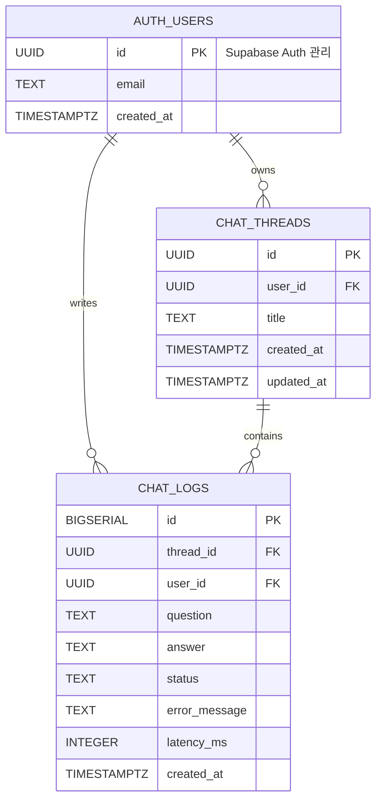

# Chat API 설계 문서

배포 환경은 **Render(FastAPI) + Supabase(PostgreSQL)** 를 기준으로 한다.
초안은 SQLite 로 작성되었으나 아래 내용은 모두 PostgreSQL 기준으로 옮긴 것이다.
변경 내역은 [11. SQLite 초안 대비 변경점](#11-sqlite-초안-대비-변경점) 에 정리했다.

## 1. 시스템 구성

```text
브라우저 (Jinja2 템플릿 + fetch)
    │
    │ HTTPS · HttpOnly 쿠키
    ▼
FastAPI (async)
    │
    ├── Authentication
    │      └── Supabase Auth (auth.users)
    │
    ├── Chat API
    │      ├── chat_threads
    │      └── chat_logs
    │
    └── LangGraph Agent
           ├── create_agent
           ├── SummarizationMiddleware   최근 4개 메시지 유지, 그 이전은 요약
           └── AsyncPostgresSaver
                  ├── checkpoints
                  ├── checkpoint_writes
                  └── checkpoint_blobs
                          │
                          ▼
                  Supabase PostgreSQL
```

### 각 저장 영역의 역할

| 구성 | 역할 |
|---|---|
| `auth.users` | 사용자 인증 및 식별. **Supabase Auth 가 관리** |
| `chat_threads` | 사용자별 채팅방 관리 |
| `chat_logs` | 전체 질문/응답 원본 저장 |
| `AsyncPostgresSaver` | LangGraph State 저장 및 복구 |
| `SummarizationMiddleware` | 오래된 대화 Context 압축 |

서비스 테이블(`users`, `chat_threads`, `chat_logs`)과 LangGraph 체크포인트 테이블은
**같은 Supabase 데이터베이스 안에 공존**하지만 서로 다른 목적을 가진다.
전자는 우리가 스키마를 정의하고, 후자는 LangGraph 가 자동으로 생성·관리한다.

---

## 2. ERD

### 2.1 서비스 DB



`auth.users` 는 Supabase Auth 가 소유하는 테이블이다. 우리가 만들지도, 수정하지도 않는다.
위 ERD 에는 참조 관계를 보이기 위해 주요 컬럼만 표시했다.

### 2.2 LangGraph Persistence 관계

LangGraph 체크포인트 테이블은 서비스 DB 와 FK 를 연결하지 않고, 논리적으로 `thread_id` 만 공유한다.

```text
users
  │ user_id
  ▼
chat_threads
  │ thread_id
  ├───────────────────────────────┐
  ▼                               ▼
chat_logs                  LangGraph AsyncPostgresSaver
                            ├── checkpoints
                            ├── checkpoint_writes
                            └── checkpoint_blobs
```

```text
chat_threads.id  =  LangGraph configurable.thread_id
```

LangGraph 는 `user_id` 를 알 필요가 없다. `user_id` 는 FastAPI 가 해당 `thread_id` 의
소유권을 확인할 때만 사용한다.

---

## 3. 테이블 정의

아래 DDL 을 그대로 담은 실행용 스크립트가 **`scripts/schema.sql`** 에 있다.
Supabase SQL Editor 에 붙여넣고 실행하면 되며, 여러 번 실행해도 안전하다.
평가자용 조회 쿼리는 `scripts/check_logs.sql` 을 참고한다.

### 3.1 users — 만들지 않는다

사용자 계정은 **Supabase Auth 가 관리하는 `auth.users` 를 그대로 쓴다.**
`users` 테이블을 직접 만들지 않으며, 비밀번호 해시도 우리가 보관하지 않는다.

- PK 는 `UUID` 다. 따라서 아래 테이블의 `user_id` 도 모두 `UUID` 다
- 로그인 식별자는 **email** 이다. Supabase Auth 는 임의의 username 을 기본 지원하지 않는다
- 개발 중에는 Supabase 대시보드에서 **이메일 확인(Confirm email)을 꺼야** 가입 즉시 로그인된다

프로필 정보(닉네임 등)가 필요해지면 `auth.users.id` 를 PK 이자 FK 로 갖는
`profiles` 테이블을 별도로 만든다. 현재 요구사항에는 필요하지 않다.

### 3.2 chat_threads

```sql
CREATE TABLE chat_threads (
    id         UUID        PRIMARY KEY DEFAULT gen_random_uuid(),
    user_id    UUID        NOT NULL REFERENCES auth.users(id) ON DELETE CASCADE,
    title      TEXT        NOT NULL DEFAULT '새 대화',
    created_at TIMESTAMPTZ NOT NULL DEFAULT now(),
    updated_at TIMESTAMPTZ NOT NULL DEFAULT now()
);

CREATE INDEX idx_chat_threads_user_updated
    ON chat_threads (user_id, updated_at DESC);
```

| 필드 | 설명 |
|---|---|
| `id` | Thread ID. 그대로 LangGraph `thread_id` 로 사용 |
| `user_id` | 채팅방 소유 사용자 |
| `title` | 채팅방 제목 |
| `created_at` | 생성 시간 |
| `updated_at` | 최근 대화 시간. 목록 정렬 기준 |

인덱스는 "내 채팅 목록을 `updated_at DESC` 로 조회"하는 주 질의를 그대로 커버한다.

`id` 는 애플리케이션에서 UUID 를 만들어 넣어도 되고, 생략하면 DB 가 `gen_random_uuid()`
로 채운다. SQLite 초안에서 `TEXT` 였던 것을 네이티브 `UUID` 타입으로 바꿨다.

### 3.3 chat_logs

```sql
CREATE TABLE chat_logs (
    id            BIGSERIAL   PRIMARY KEY,
    thread_id     UUID        NOT NULL REFERENCES chat_threads(id) ON DELETE CASCADE,
    user_id       UUID        NOT NULL REFERENCES auth.users(id) ON DELETE CASCADE,
    question      TEXT        NOT NULL,
    answer        TEXT,
    status        TEXT        NOT NULL DEFAULT 'success'
                              CHECK (status IN ('success', 'error')),
    error_message TEXT,
    latency_ms    INTEGER,
    created_at    TIMESTAMPTZ NOT NULL DEFAULT now()
);

CREATE INDEX idx_chat_logs_thread_created ON chat_logs (thread_id, created_at);
CREATE INDEX idx_chat_logs_user_created   ON chat_logs (user_id, created_at DESC);
```

초안 대비 두 컬럼을 추가했다.

- **`user_id`** — 초안에는 `thread_id` 만 있어서 "사용자 기준 로그 조회"에 항상 조인이 필요했다.
  과제 요구사항이 최소 추적 필드로 **사용자 식별**을 명시하고 있어, 평가자가 조인 없이
  `SELECT * FROM chat_logs WHERE user_id = '...'` 로 바로 확인할 수 있게 비정규화했다.
- **`latency_ms`** — AI 호출 소요 시간. 운영 로그 및 지연 원인 추적용.

`status` 에는 `CHECK` 제약을 걸어 `success` / `error` 외의 값이 들어가지 않게 한다.

### 3.4 updated_at 자동 갱신

```sql
CREATE OR REPLACE FUNCTION touch_updated_at()
RETURNS TRIGGER AS $$
BEGIN
    NEW.updated_at = now();
    RETURN NEW;
END;
$$ LANGUAGE plpgsql;

CREATE TRIGGER trg_chat_threads_updated_at
    BEFORE UPDATE ON chat_threads
    FOR EACH ROW EXECUTE FUNCTION touch_updated_at();
```

SQLite 에서는 애플리케이션이 매번 `updated_at` 을 직접 넣어야 했지만,
PostgreSQL 에서는 트리거로 처리해 누락을 방지한다.

### 3.5 LangGraph 체크포인트 테이블

`checkpoints`, `checkpoint_writes`, `checkpoint_blobs`, `checkpoint_migrations` 는
**직접 만들지 않는다.** 애플리케이션 시작 시 `await checkpointer.setup()` 이 한 번 실행되면
LangGraph 가 알아서 생성한다. 스키마도 LangGraph 버전에 종속되므로 임의로 수정하지 않는다.

---

## 4. Supabase 연결

### 4.1 연결 모드 선택

Supabase 는 두 가지 Connection Pooler 모드를 제공한다. **어느 쪽을 쓰느냐가
LangGraph 동작에 직접 영향을 준다.**

| 모드 | 포트 | Prepared Statement | 권장 |
|---|---|---|---|
| Session | 5432 | 지원 | **이쪽을 쓴다** |
| Transaction | 6543 | 미지원 | 쓰려면 추가 설정 필요 |

`AsyncPostgresSaver` 는 psycopg 를 사용하고, psycopg 는 같은 쿼리가 반복되면 자동으로
prepared statement 로 전환한다. Transaction 모드 풀러는 이를 지원하지 않아
`prepared statement ... does not exist` 류의 오류가 간헐적으로 발생한다.

Transaction 모드를 반드시 써야 한다면 연결 옵션에 `prepare_threshold=None` 을 지정해
prepared statement 를 끈다.

또한 Direct connection 은 IPv6 라 실행 환경에 따라 접속되지 않을 수 있다.
**Pooler 주소를 사용한다.**

### 4.2 초기화 코드

```python
from psycopg_pool import AsyncConnectionPool
from langgraph.checkpoint.postgres.aio import AsyncPostgresSaver

pool = AsyncConnectionPool(
    conninfo=settings.DATABASE_URL,
    min_size=1,
    max_size=5,                      # Supabase 무료 플랜은 동시 연결 수가 제한적이다
    kwargs={
        "autocommit": True,          # checkpointer.setup() 의 DDL 실행에 필요
        "prepare_threshold": None,   # Transaction 모드 풀러 사용 시 필수
    },
    open=False,
)

await pool.open()
checkpointer = AsyncPostgresSaver(pool)
await checkpointer.setup()           # 최초 1회. 이미 있으면 아무 일도 하지 않는다
```

`setup()` 은 애플리케이션 시작 시 lifespan 이벤트에서 한 번만 호출한다.

### 4.3 저장 용량 주의

Supabase 무료 플랜은 **데이터베이스 500MB** 다.
LangGraph 체크포인터는 대화 스텝마다 State 스냅샷을 기록하므로,
`chat_logs` 보다 `checkpoints` 계열 테이블이 훨씬 빠르게 커진다.

- `SummarizationMiddleware` 가 컨텍스트를 압축하므로 증가 속도는 억제된다
- 삭제된 채팅은 `adelete_thread()` 로 체크포인트도 함께 정리한다
- 용량은 Supabase 대시보드에서 주기적으로 확인한다

---

## 5. Context 관리 및 AI 에이전트 구성

### 5.1 Context 흐름

```text
현재 질문
   │
   ▼
thread_id
   │
   ▼
AsyncPostgresSaver
   │
   └── 기존 State 복구
            │
            ▼
   SummarizationMiddleware
            │
      최근 4개 메시지는 원문 유지
      그 이전은 요약으로 압축
            │
            ▼
           LLM
            │
            ▼
       새로운 State
            │
            ▼
   AsyncPostgresSaver
```

**FastAPI 는 과거 대화를 다시 전달하지 않는다.** 같은 `thread_id` 를 넘기면
체크포인터가 기존 State 를 복구한다.

```python
result = await agent.ainvoke(
    {"messages": [{"role": "user", "content": body.message}]},
    config={"configurable": {"thread_id": str(thread_id)}},
)
```

`chat_logs` 는 컨텍스트 관리용이 **아니다.** 미들웨어가 오래된 메시지를 압축하더라도
`chat_logs` 의 원본은 그대로 유지된다.

### 5.2 패키지

```text
langchain>=1.3,<2
langgraph>=1.0,<2
langgraph-checkpoint-postgres      # 초안의 langgraph-checkpoint-sqlite 대체
langchain-openai>=1.0
psycopg[binary,pool]>=3.2          # 초안의 aiosqlite 대체
supabase                           # Supabase Auth 호출용
jinja2
python-dotenv
```

`LANGGRAPH_STRICT_MSGPACK=true` 를 설정한다. 체크포인트 역직렬화 시 허용되지 않은
타입이 들어오는 것을 막는다.

### 5.3 에이전트 구성

```python
from langchain.agents import create_agent
from langchain.agents.middleware import SummarizationMiddleware
from langchain.chat_models import init_chat_model

SYSTEM_PROMPT = (
    "너는 간결하고 정확한 AI 어시스턴트다. "
    "이전 대화의 결정사항과 제약조건을 일관되게 유지한다."
)


def build_agent(checkpointer):
    main_model = init_chat_model(settings.MODEL_NAME, temperature=0)
    summary_model = init_chat_model(settings.MODEL_NAME, temperature=0)

    return create_agent(
        model=main_model,
        tools=[],
        system_prompt=SYSTEM_PROMPT,
        middleware=[
            SummarizationMiddleware(
                model=summary_model,
                trigger=("tokens", settings.SUMMARY_TRIGGER_TOKENS),
                keep=("tokens", settings.SUMMARY_KEEP_TOKENS),
                summary_prompt=SUMMARY_PROMPT,
            )
        ],
        checkpointer=checkpointer,
        name="main_agent",
    )
```

`create_agent()` 는 compiled graph 를 반환한다. 따라서 `agent.get_state(config)` 로
특정 thread 의 현재 State 를 확인할 수 있고, 나중에 상위 `StateGraph` 의 subgraph 로
넣어 멀티 에이전트로 확장할 수도 있다.

### 5.4 요약 기준

| 기준 | 설정 | 용도 |
|---|---|---|
| 메시지 수 | `trigger=("messages", 6)`, `keep=("messages", 4)` | 데모·디버깅 |
| **토큰 수** | `trigger=("tokens", 8000)`, `keep=("tokens", 4000)` | **운영** |
| 비율 | `trigger=("fraction", 0.8)`, `keep=("fraction", 0.4)` | 모델 context window 기준 |

운영에서는 **토큰 기준을 쓴다.** tool call 이나 멀티 에이전트가 들어가면
"최근 N개 메시지 = N/2 턴"이 성립하지 않기 때문이다.

요약이 동작하는지 눈으로 확인하려면 `trigger=("messages", 6)` 처럼 임계값을 낮춰
빠르게 트리거되게 한 뒤 `agent.get_state()` 로 State 를 들여다보면 된다.

### 5.5 요약 프롬프트

`{messages}` 플레이스홀더와 `<messages>` 블록은 **반드시 유지한다.**

```text
<role>
Conversation Context Compressor
</role>

<instructions>
아래 과거 대화를 이후 대화를 이어가는 데 필요한 정보만 남기도록 압축하라.

반드시 보존:
- 사용자의 현재 목표
- 이미 결정된 사항
- 사용자가 명시한 제약조건
- 중요한 기술명, 수치, 고유명사
- 현재 진행 중인 작업
- 아직 해결되지 않은 질문

제외:
- 인사말
- 반복 설명
- 이미 의미가 없어진 중간 대화
- 불필요한 표현

가능하면 아래 형식을 사용하라.

## GOAL
## DECISIONS
## CONSTRAINTS
## OPEN ITEMS

요약 결과만 반환하라.
</instructions>

<messages>
{messages}
</messages>
```

압축이 일어나면 State 의 첫 메시지가 이 형식의 요약본으로 바뀌고,
그 뒤로 최근 메시지 원문이 이어진다.

### 5.6 lifespan 에서 조립

체크포인터와 에이전트는 요청마다 만들지 않고 애플리케이션 수명 동안 한 번만 만든다.

```python
from contextlib import asynccontextmanager

from fastapi import FastAPI
from psycopg_pool import AsyncConnectionPool
from langgraph.checkpoint.postgres.aio import AsyncPostgresSaver


@asynccontextmanager
async def lifespan(app: FastAPI):
    pool = AsyncConnectionPool(
        conninfo=settings.DATABASE_URL,
        min_size=1,
        max_size=5,
        kwargs={"autocommit": True, "prepare_threshold": None},
        open=False,
    )
    await pool.open()

    checkpointer = AsyncPostgresSaver(pool)
    await checkpointer.setup()

    app.state.checkpointer = checkpointer
    app.state.agent = build_agent(checkpointer)
    try:
        yield
    finally:
        await pool.close()


app = FastAPI(lifespan=lifespan)
```

라우터에서는 `request.app.state.agent` 로 꺼내 쓴다.
초안 노트북의 `AsyncSqliteSaver.from_conn_string("app.db")` 를 대체하는 부분이다.

---

## 6. API 목록

Base URL: `/api`

모든 Chat API 는 로그인된 사용자를 기준으로 처리한다.

### 화면 (Jinja2)

| Method | Path | 설명 | 인증 |
|---|---|---|---|
| `GET` | `/signup` | 회원가입 화면 | 불필요 |
| `GET` | `/login` | 로그인 화면 | 불필요 |
| `GET` | `/` | 채팅 화면 | **필요** (미로그인 시 `/login` 리다이렉트) |

### 인증 API

| Method | Endpoint | 설명 |
|---|---|---|
| `POST` | `/api/auth/signup` | 회원가입. Supabase Auth 로 계정 생성 |
| `POST` | `/api/auth/login` | 로그인. 성공 시 HttpOnly 쿠키 발급 |
| `POST` | `/api/auth/logout` | 로그아웃. 쿠키 삭제 |
| `GET` | `/api/me` | 현재 로그인 사용자 확인 |

### Chat API

| Method | Endpoint | 설명 |
|---|---|---|
| `POST` | `/api/threads` | 새 채팅 생성 |
| `GET` | `/api/threads` | 내 채팅 목록 조회 |
| `PATCH` | `/api/threads/{thread_id}` | 채팅 제목 변경 |
| `DELETE` | `/api/threads/{thread_id}` | 채팅 삭제 |
| `GET` | `/api/threads/{thread_id}/messages` | 대화 내역 조회 |
| `POST` | `/api/threads/{thread_id}/messages` | 메시지 전송 |
| `GET` | `/health` | 서버 상태 확인 |

---

## 7. API 상세 명세

### 7.1 새 채팅 생성

```http
POST /api/threads
```

```json
{ "title": "LangGraph 질문" }
```

`title` 은 생략 가능하며, 생략하면 `"새 대화"` 로 생성한다.

**Response 201**

```json
{
  "id": "5aa60fa8-c927-4416-b559-f9661b7df00f",
  "title": "LangGraph 질문",
  "created_at": "2026-08-22T17:30:00+09:00",
  "updated_at": "2026-08-22T17:30:00+09:00"
}
```

생성된 `id` 가 LangGraph 의 `thread_id` 가 된다.

### 7.2 내 채팅 목록 조회

```http
GET /api/threads
```

**Response 200** — `updated_at DESC` 정렬

```json
[
  {
    "id": "5aa60fa8-c927-4416-b559-f9661b7df00f",
    "title": "LangGraph 질문",
    "created_at": "2026-08-22T17:30:00+09:00",
    "updated_at": "2026-08-22T17:40:00+09:00"
  }
]
```

### 7.3 채팅 제목 변경

```http
PATCH /api/threads/{thread_id}
```

```json
{ "title": "LangGraph 멀티에이전트" }
```

**Response 200** — 변경된 thread 객체

### 7.4 과거 대화 조회

```http
GET /api/threads/{thread_id}/messages
```

**Response 200** — `chat_logs` 에서 조회, `created_at ASC` 정렬

```json
[
  {
    "id": 1,
    "question": "LangGraph가 뭐야?",
    "answer": "LangGraph는...",
    "status": "success",
    "created_at": "2026-08-22T17:31:00+09:00"
  }
]
```

### 7.5 메시지 전송

```http
POST /api/threads/{thread_id}/messages
```

```json
{ "message": "내가 아까 DB 뭐 쓴다고 했지?" }
```

**입력 검증** — 공백만 있는 값 차단, 최대 2000자

**내부 처리**

```text
1. 로그인 사용자 확인
2. thread_id 조회
3. 해당 thread 가 현재 사용자 소유인지 확인
4. LangGraph 호출
5. AI 응답 반환
6. chat_logs 저장
7. chat_threads.updated_at 갱신 (트리거)
```

**Response 200**

```json
{
  "thread_id": "5aa60fa8-c927-4416-b559-f9661b7df00f",
  "answer": "SQLite를 사용한다고 하셨습니다."
}
```

**오류 발생 시** — LLM 호출 실패나 타임아웃도 `chat_logs` 에 기록한다.

```text
status        = 'error'
answer        = NULL
error_message = 실제 오류 내용
```

| 상황 | 상태 코드 | 응답 |
|---|---|---|
| 미로그인 | 401 | 로그인 안내 |
| 타인 thread 접근 | 404 | 존재 여부를 노출하지 않음 |
| 입력 검증 실패 | 422 | 검증 오류 내용 |
| AI 호출 타임아웃 | 504 | `{"error_code": "AI_TIMEOUT"}` |
| AI 호출 실패 | 502 | `{"error_code": "AI_UPSTREAM_ERROR"}` |

사용자에게 노출하는 메시지에는 내부 오류 원문을 담지 않는다.
원문은 `chat_logs.error_message` 와 서버 로그에만 남긴다.

### 7.6 채팅 삭제

```http
DELETE /api/threads/{thread_id}
```

**내부 처리**

```text
chat_threads 삭제
        ↓ ON DELETE CASCADE
chat_logs 삭제
```

LangGraph 체크포인트는 CASCADE 대상이 아니므로 **별도로 삭제**한다.

```python
await checkpointer.adelete_thread(str(thread_id))
```

이 호출을 빠뜨리면 삭제된 채팅의 State 가 DB 에 계속 남아 용량을 잠식한다.

**Response 204**

### 7.7 Health Check

```http
GET /health
```

```json
{ "status": "ok" }
```

DB 에 가벼운 질의(`SELECT 1`)를 포함시킨다. Render 와 Supabase 의 유휴 정지를
막는 cron 이 이 엔드포인트를 호출하기 때문이다. 자세한 내용은
[architecture.md](./architecture.md) 2장 참고.

---

## 8. 인증 및 보안

### 8.1 인증 흐름

자격 증명 관리는 Supabase Auth 에 위임하고, **세션 유지와 접근 제어는 FastAPI 가 담당한다.**

```text
Jinja2 회원가입/로그인 폼
        ↓
FastAPI  POST /api/auth/login
        ↓
Supabase Auth  sign_in_with_password()
        ↓
access_token / refresh_token 수신
        ↓
FastAPI 가 HttpOnly 쿠키로 발급
        ↓
이후 모든 요청에 브라우저가 자동 전송
```

토큰을 브라우저 JavaScript 에 넘기지 않고 **HttpOnly 쿠키에만** 담는다.
`localStorage` 에 두면 XSS 로 탈취될 수 있다. Render 는 HTTPS 를 제공하므로
`secure=True`, `samesite="lax"` 를 함께 설정한다.

### 8.2 토큰 검증

요청마다 쿠키의 `access_token` 을 검증해 사용자를 식별한다.

```python
async def get_current_user(request: Request) -> User:
    token = request.cookies.get("access_token")
    if not token:
        raise HTTPException(401, "로그인이 필요합니다")
    user = await verify_token(token)     # 아래 두 방식 중 하나
    if user is None:
        raise HTTPException(401, "세션이 만료되었습니다")
    return user
```

| 방식 | 장점 | 단점 |
|---|---|---|
| **Supabase 에 조회** (`auth.get_user(token)`) | 구현이 단순하고 확실하다 | 요청마다 외부 왕복이 생긴다 |
| 로컬 JWT 검증 | 빠르다 | 프로젝트의 서명 방식 확인이 필요하다 |

**초기에는 Supabase 조회 방식으로 간다.** 지연이 문제가 되면 로컬 검증으로 바꾼다.
검증 키 설정은 Supabase 대시보드의 JWT 설정에서 확인한다.

### 8.3 Thread 소유권 확인

`thread_id` 만으로 LangGraph 를 호출하면 안 된다.

```text
로그인 사용자 → current_user.id → chat_threads 조회
                                        ↓
                    thread.user_id == current_user.id ?
                                        ↓ YES
                                  LangGraph 호출
```

```python
thread = await get_owned_thread(db, thread_id, current_user.id)
```

다른 사용자의 thread 이면 **403 이 아니라 404** 로 응답한다.
403 을 주면 "그 ID 의 thread 가 존재한다"는 사실이 노출된다.

### 8.4 RLS 는 켜되 정책은 만들지 않는다

Supabase 는 **`public` 스키마의 테이블을 PostgREST 로 자동 노출한다.**
`anon` 키는 클라이언트에 배포되는 공개 키이므로, RLS 를 끈 채로 두면
누구나 REST API 로 `chat_logs` 를 읽을 수 있다.

따라서 두 테이블에 **RLS 를 켜되 정책은 하나도 만들지 않는다.**

```sql
ALTER TABLE public.chat_threads ENABLE ROW LEVEL SECURITY;
ALTER TABLE public.chat_logs    ENABLE ROW LEVEL SECURITY;
```

| 접근 경로 | 결과 |
|---|---|
| PostgREST + `anon` 키 | **전부 차단** (정책이 없으므로 통과하는 행이 없다) |
| 서버의 `DATABASE_URL` 접속 | 소유자 역할이라 RLS 를 우회한다. 영향 없음 |

즉 **접근 제어의 주체는 FastAPI 의 소유권 확인**이고, RLS 는 외부 직접 접근을 막는
차단벽 역할만 한다. 정책을 세밀하게 작성해 로직을 두 군데로 나누지는 않는다.

**LangGraph 체크포인트 테이블에도 똑같이 적용한다.** 오히려 이쪽이 더 중요하다.
`checkpoint_blobs` 에는 대화 메시지 State 가 그대로 들어가기 때문이다.

이 테이블들은 `checkpointer.setup()` 이 만들기 때문에 `scripts/schema.sql` 로는
다룰 수 없다. 그래서 애플리케이션이 시작할 때 `secure_checkpoint_tables()` 가
`setup()` 직후에 RLS 를 켠다. LangGraph 마이그레이션이 테이블을 다시 만들 수 있으므로
매 시작마다 실행한다.

```text
checkpoints  checkpoint_writes  checkpoint_blobs  checkpoint_migrations
```

여기에 더해 **Supabase 서비스 키가 클라이언트로 나가지 않아야 한다.** 브라우저는
우리 FastAPI 만 호출하고, Supabase 와의 통신은 전부 서버에서 일어난다.

---

## 9. 화면 연동 흐름

| 시점 | 호출 | 처리 |
|---|---|---|
| 로그인 직후 | `GET /api/threads` | 좌측 사이드바 대화 목록 구성 |
| 새 대화 클릭 | `POST /api/threads` | 반환된 `thread_id` 를 현재 화면 상태로 보관 |
| 메시지 입력 | `POST /api/threads/{id}/messages` | 응답을 말풍선으로 추가 |
| 기존 대화 클릭 | `GET /api/threads/{id}/messages` | `chat_logs` 로 화면 복구 |

첫 진입 시 채팅 화면은 Jinja2 가 서버에서 렌더링하고, 이후 메시지 송수신만
`fetch` 로 처리한다. 응답을 기다리는 동안 전송 버튼을 비활성화해 중복 요청을 막는다.

---

## 10. 최종 데이터 흐름

```text
                  User
                   ▼
        브라우저 (Jinja2 + fetch)
                   ▼
                FastAPI
                   │ current_user.id  (Supabase Auth 검증)
                   ▼
             chat_threads
                   │ thread_id
         ┌─────────┴─────────┐
         ▼                   ▼
     chat_logs          LangGraph Agent
   전체 Q/A 원본              ▼
                     SummarizationMiddleware
                              ▼
                             LLM
                              ▼
                     AsyncPostgresSaver
                     (Supabase PostgreSQL)
```

---

## 11. SQLite 초안 대비 변경점

| 항목 | SQLite 초안 | Supabase (현재) |
|---|---|---|
| 체크포인터 | `SqliteSaver` / `AsyncSqliteSaver` | `AsyncPostgresSaver` |
| 체크포인터 패키지 | `langgraph-checkpoint-sqlite` | `langgraph-checkpoint-postgres` |
| DB 드라이버 | `aiosqlite` | `psycopg[binary,pool]` |
| 자동 증가 PK | `INTEGER PRIMARY KEY AUTOINCREMENT` | `BIGSERIAL PRIMARY KEY` |
| Thread ID | `TEXT` | `UUID` (`gen_random_uuid()`) |
| 시각 타입 | `DATETIME` | `TIMESTAMPTZ` |
| 기본값 | `CURRENT_TIMESTAMP` | `now()` |
| `updated_at` 갱신 | 애플리케이션이 직접 | `BEFORE UPDATE` 트리거 |
| 연결 | 파일 경로 | Connection Pooler (Session 모드) |
| 동시성 | 쓰기 잠금 주의, 워커 1개 | 제약 없음 |
| 용량 | 디스크 여유만큼 | **500MB 상한** |
| 사용자 테이블 | 직접 만든 `users` | **Supabase Auth 의 `auth.users`** |
| `user_id` 타입 | `INTEGER` | `UUID` |
| 로그인 식별자 | username | email |

추가된 항목

- `chat_logs.user_id` — 사용자 기준 로그 조회를 조인 없이 수행
- `chat_logs.latency_ms` — AI 응답 소요 시간 추적
- `status` `CHECK` 제약
- 조회 패턴에 맞춘 인덱스 2종
- 타임아웃(504)과 업스트림 오류(502) 상태 코드 분리

---

## 12. 미결 사항

### 12.1 AI 호출 타임아웃

`create_agent` 구성과 미들웨어 설정은 5장에 반영했다. 다만 타임아웃 처리는 아직 정하지 않았다.

`agent.ainvoke()` 는 내부적으로 요약 호출과 본 응답 호출을 **각각 수행**하므로,
요약이 트리거된 턴은 평소보다 오래 걸린다. 단순히 전체를 20초로 묶으면 요약이 도는 턴마다
타임아웃이 날 수 있다. 아래 중 하나를 택한다.

1. 모델 클라이언트 레벨에서 `timeout` 을 지정하고, 전체는 넉넉히 잡는다
2. `asyncio.wait_for()` 로 전체를 감싸되 요약 발생을 감안해 여유를 둔다

어느 쪽이든 실패 시 `chat_logs.status = 'error'` 기록과 504 응답은 동일하다.

---

## 13. 환경 변수

| 키 | 설명 |
|---|---|
| `OPENAI_API_KEY` | LLM API 인증 키 |
| `MODEL_NAME` | 모델 식별자. 예: `openai:gpt-4.1-mini` |
| `DATABASE_URL` | Supabase PostgreSQL 연결 문자열 (Pooler Session 모드) |
| `SUPABASE_URL` | Supabase 프로젝트 URL |
| `SUPABASE_ANON_KEY` | Supabase Auth 호출용 공개 키 |
| `SUPABASE_SERVICE_ROLE_KEY` | 서버 전용 키. **절대 클라이언트로 내보내지 않는다** |
| `LANGGRAPH_STRICT_MSGPACK` | 체크포인트 역직렬화 타입 제한. `true` 로 둔다 |
| `SUMMARY_TRIGGER_TOKENS` | 요약을 시작할 토큰 임계값 (기본 8000) |
| `SUMMARY_KEEP_TOKENS` | 원문으로 유지할 토큰 수 (기본 4000) |
| `AI_TIMEOUT_SECONDS` | AI 호출 타임아웃 |
| `LOG_LEVEL` | 로그 레벨 |

`init_chat_model()` 은 `MODEL_NAME` 의 접두어(`openai:`)로 공급자를 판별한다.
공급자를 바꾸려면 `MODEL_NAME` 과 해당 SDK 패키지, API 키 환경 변수를 함께 교체한다.

토큰 검증을 로컬 JWT 방식으로 전환하면 검증 키 관련 변수가 추가된다.
