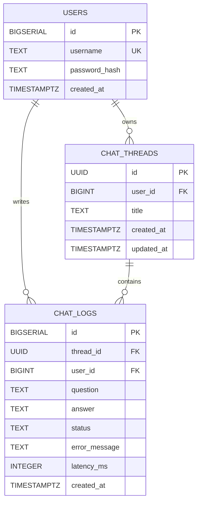

# Chat API 설계 문서

배포 환경은 **Render(FastAPI) + Supabase(PostgreSQL)** 를 기준으로 한다.
초안은 SQLite 로 작성되었으나 아래 내용은 모두 PostgreSQL 기준으로 옮긴 것이다.
변경 내역은 [11. SQLite 초안 대비 변경점](#11-sqlite-초안-대비-변경점) 에 정리했다.

## 1. 시스템 구성

```text
Streamlit
    │
    │ REST API
    ▼
FastAPI (async)
    │
    ├── Authentication
    │      └── users
    │
    ├── Chat API
    │      ├── chat_threads
    │      └── chat_logs
    │
    └── LangGraph Agent
           ├── create_agent
           ├── SummarizationMiddleware   최근 4개 메시지 유지, 그 이전은 요약
           └── AsyncPostgresSaver
                  ├── checkpoints
                  ├── checkpoint_writes
                  └── checkpoint_blobs
                          │
                          ▼
                  Supabase PostgreSQL
```

### 각 저장 영역의 역할

| 구성 | 역할 |
|---|---|
| `users` | 사용자 인증 및 식별 |
| `chat_threads` | 사용자별 채팅방 관리 |
| `chat_logs` | 전체 질문/응답 원본 저장 |
| `AsyncPostgresSaver` | LangGraph State 저장 및 복구 |
| `SummarizationMiddleware` | 오래된 대화 Context 압축 |

서비스 테이블(`users`, `chat_threads`, `chat_logs`)과 LangGraph 체크포인트 테이블은
**같은 Supabase 데이터베이스 안에 공존**하지만 서로 다른 목적을 가진다.
전자는 우리가 스키마를 정의하고, 후자는 LangGraph 가 자동으로 생성·관리한다.

---

## 2. ERD

### 2.1 서비스 DB



### 2.2 LangGraph Persistence 관계

LangGraph 체크포인트 테이블은 서비스 DB 와 FK 를 연결하지 않고, 논리적으로 `thread_id` 만 공유한다.

```text
users
  │ user_id
  ▼
chat_threads
  │ thread_id
  ├───────────────────────────────┐
  ▼                               ▼
chat_logs                  LangGraph AsyncPostgresSaver
                            ├── checkpoints
                            ├── checkpoint_writes
                            └── checkpoint_blobs
```

```text
chat_threads.id  =  LangGraph configurable.thread_id
```

LangGraph 는 `user_id` 를 알 필요가 없다. `user_id` 는 FastAPI 가 해당 `thread_id` 의
소유권을 확인할 때만 사용한다.

---

## 3. 테이블 정의

모든 DDL 은 Supabase SQL Editor 에서 그대로 실행 가능하다.

### 3.1 users

```sql
CREATE TABLE users (
    id            BIGSERIAL   PRIMARY KEY,
    username      TEXT        NOT NULL UNIQUE,
    password_hash TEXT        NOT NULL,
    created_at    TIMESTAMPTZ NOT NULL DEFAULT now()
);
```

### 3.2 chat_threads

```sql
CREATE TABLE chat_threads (
    id         UUID        PRIMARY KEY DEFAULT gen_random_uuid(),
    user_id    BIGINT      NOT NULL REFERENCES users(id) ON DELETE CASCADE,
    title      TEXT        NOT NULL DEFAULT '새 대화',
    created_at TIMESTAMPTZ NOT NULL DEFAULT now(),
    updated_at TIMESTAMPTZ NOT NULL DEFAULT now()
);

CREATE INDEX idx_chat_threads_user_updated
    ON chat_threads (user_id, updated_at DESC);
```

| 필드 | 설명 |
|---|---|
| `id` | Thread ID. 그대로 LangGraph `thread_id` 로 사용 |
| `user_id` | 채팅방 소유 사용자 |
| `title` | 채팅방 제목 |
| `created_at` | 생성 시간 |
| `updated_at` | 최근 대화 시간. 목록 정렬 기준 |

인덱스는 "내 채팅 목록을 `updated_at DESC` 로 조회"하는 주 질의를 그대로 커버한다.

`id` 는 애플리케이션에서 UUID 를 만들어 넣어도 되고, 생략하면 DB 가 `gen_random_uuid()`
로 채운다. SQLite 초안에서 `TEXT` 였던 것을 네이티브 `UUID` 타입으로 바꿨다.

### 3.3 chat_logs

```sql
CREATE TABLE chat_logs (
    id            BIGSERIAL   PRIMARY KEY,
    thread_id     UUID        NOT NULL REFERENCES chat_threads(id) ON DELETE CASCADE,
    user_id       BIGINT      NOT NULL REFERENCES users(id) ON DELETE CASCADE,
    question      TEXT        NOT NULL,
    answer        TEXT,
    status        TEXT        NOT NULL DEFAULT 'success'
                              CHECK (status IN ('success', 'error')),
    error_message TEXT,
    latency_ms    INTEGER,
    created_at    TIMESTAMPTZ NOT NULL DEFAULT now()
);

CREATE INDEX idx_chat_logs_thread_created ON chat_logs (thread_id, created_at);
CREATE INDEX idx_chat_logs_user_created   ON chat_logs (user_id, created_at DESC);
```

초안 대비 두 컬럼을 추가했다.

- **`user_id`** — 초안에는 `thread_id` 만 있어서 "사용자 기준 로그 조회"에 항상 조인이 필요했다.
  과제 요구사항이 최소 추적 필드로 **사용자 식별**을 명시하고 있어, 평가자가 조인 없이
  `SELECT * FROM chat_logs WHERE user_id = 1` 로 바로 확인할 수 있게 비정규화했다.
- **`latency_ms`** — AI 호출 소요 시간. 운영 로그 및 지연 원인 추적용.

`status` 에는 `CHECK` 제약을 걸어 `success` / `error` 외의 값이 들어가지 않게 한다.

### 3.4 updated_at 자동 갱신

```sql
CREATE OR REPLACE FUNCTION touch_updated_at()
RETURNS TRIGGER AS $$
BEGIN
    NEW.updated_at = now();
    RETURN NEW;
END;
$$ LANGUAGE plpgsql;

CREATE TRIGGER trg_chat_threads_updated_at
    BEFORE UPDATE ON chat_threads
    FOR EACH ROW EXECUTE FUNCTION touch_updated_at();
```

SQLite 에서는 애플리케이션이 매번 `updated_at` 을 직접 넣어야 했지만,
PostgreSQL 에서는 트리거로 처리해 누락을 방지한다.

### 3.5 LangGraph 체크포인트 테이블

`checkpoints`, `checkpoint_writes`, `checkpoint_blobs`, `checkpoint_migrations` 는
**직접 만들지 않는다.** 애플리케이션 시작 시 `await checkpointer.setup()` 이 한 번 실행되면
LangGraph 가 알아서 생성한다. 스키마도 LangGraph 버전에 종속되므로 임의로 수정하지 않는다.

---

## 4. Supabase 연결

### 4.1 연결 모드 선택

Supabase 는 두 가지 Connection Pooler 모드를 제공한다. **어느 쪽을 쓰느냐가
LangGraph 동작에 직접 영향을 준다.**

| 모드 | 포트 | Prepared Statement | 권장 |
|---|---|---|---|
| Session | 5432 | 지원 | **이쪽을 쓴다** |
| Transaction | 6543 | 미지원 | 쓰려면 추가 설정 필요 |

`AsyncPostgresSaver` 는 psycopg 를 사용하고, psycopg 는 같은 쿼리가 반복되면 자동으로
prepared statement 로 전환한다. Transaction 모드 풀러는 이를 지원하지 않아
`prepared statement ... does not exist` 류의 오류가 간헐적으로 발생한다.

Transaction 모드를 반드시 써야 한다면 연결 옵션에 `prepare_threshold=None` 을 지정해
prepared statement 를 끈다.

또한 Direct connection 은 IPv6 라 실행 환경에 따라 접속되지 않을 수 있다.
**Pooler 주소를 사용한다.**

### 4.2 초기화 코드

```python
from psycopg_pool import AsyncConnectionPool
from langgraph.checkpoint.postgres.aio import AsyncPostgresSaver

pool = AsyncConnectionPool(
    conninfo=settings.DATABASE_URL,
    min_size=1,
    max_size=5,                      # Supabase 무료 플랜은 동시 연결 수가 제한적이다
    kwargs={
        "autocommit": True,          # checkpointer.setup() 의 DDL 실행에 필요
        "prepare_threshold": None,   # Transaction 모드 풀러 사용 시 필수
    },
    open=False,
)

await pool.open()
checkpointer = AsyncPostgresSaver(pool)
await checkpointer.setup()           # 최초 1회. 이미 있으면 아무 일도 하지 않는다
```

`setup()` 은 애플리케이션 시작 시 lifespan 이벤트에서 한 번만 호출한다.

### 4.3 저장 용량 주의

Supabase 무료 플랜은 **데이터베이스 500MB** 다.
LangGraph 체크포인터는 대화 스텝마다 State 스냅샷을 기록하므로,
`chat_logs` 보다 `checkpoints` 계열 테이블이 훨씬 빠르게 커진다.

- `SummarizationMiddleware` 가 컨텍스트를 압축하므로 증가 속도는 억제된다
- 삭제된 채팅은 `adelete_thread()` 로 체크포인트도 함께 정리한다
- 용량은 Supabase 대시보드에서 주기적으로 확인한다

---

## 5. Context 관리

```text
현재 질문
   │
   ▼
thread_id
   │
   ▼
AsyncPostgresSaver
   │
   └── 기존 State 복구
            │
            ▼
   SummarizationMiddleware
            │
      최근 4개 메시지는 원문 유지
      그 이전은 요약으로 압축
            │
            ▼
           LLM
            │
            ▼
       새로운 State
            │
            ▼
   AsyncPostgresSaver
```

**FastAPI 는 과거 대화를 다시 전달하지 않는다.** 같은 `thread_id` 를 넘기면
체크포인터가 기존 State 를 복구한다.

```python
result = await agent.ainvoke(
    {"messages": [{"role": "user", "content": body.message}]},
    config={"configurable": {"thread_id": str(thread_id)}},
)
```

`chat_logs` 는 컨텍스트 관리용이 **아니다.** 미들웨어가 오래된 메시지를 압축하더라도
`chat_logs` 의 원본은 그대로 유지된다.

---

## 6. API 목록

Base URL: `/api`

모든 Chat API 는 로그인된 사용자를 기준으로 처리한다.

| Method | Endpoint | 설명 |
|---|---|---|
| `POST` | `/api/threads` | 새 채팅 생성 |
| `GET` | `/api/threads` | 내 채팅 목록 조회 |
| `PATCH` | `/api/threads/{thread_id}` | 채팅 제목 변경 |
| `DELETE` | `/api/threads/{thread_id}` | 채팅 삭제 |
| `GET` | `/api/threads/{thread_id}/messages` | 대화 내역 조회 |
| `POST` | `/api/threads/{thread_id}/messages` | 메시지 전송 |
| `GET` | `/health` | 서버 상태 확인 |

---

## 7. API 상세 명세

### 7.1 새 채팅 생성

```http
POST /api/threads
```

```json
{ "title": "LangGraph 질문" }
```

`title` 은 생략 가능하며, 생략하면 `"새 대화"` 로 생성한다.

**Response 201**

```json
{
  "id": "5aa60fa8-c927-4416-b559-f9661b7df00f",
  "title": "LangGraph 질문",
  "created_at": "2026-08-22T17:30:00+09:00",
  "updated_at": "2026-08-22T17:30:00+09:00"
}
```

생성된 `id` 가 LangGraph 의 `thread_id` 가 된다.

### 7.2 내 채팅 목록 조회

```http
GET /api/threads
```

**Response 200** — `updated_at DESC` 정렬

```json
[
  {
    "id": "5aa60fa8-c927-4416-b559-f9661b7df00f",
    "title": "LangGraph 질문",
    "created_at": "2026-08-22T17:30:00+09:00",
    "updated_at": "2026-08-22T17:40:00+09:00"
  }
]
```

### 7.3 채팅 제목 변경

```http
PATCH /api/threads/{thread_id}
```

```json
{ "title": "LangGraph 멀티에이전트" }
```

**Response 200** — 변경된 thread 객체

### 7.4 과거 대화 조회

```http
GET /api/threads/{thread_id}/messages
```

**Response 200** — `chat_logs` 에서 조회, `created_at ASC` 정렬

```json
[
  {
    "id": 1,
    "question": "LangGraph가 뭐야?",
    "answer": "LangGraph는...",
    "status": "success",
    "created_at": "2026-08-22T17:31:00+09:00"
  }
]
```

### 7.5 메시지 전송

```http
POST /api/threads/{thread_id}/messages
```

```json
{ "message": "내가 아까 DB 뭐 쓴다고 했지?" }
```

**입력 검증** — 공백만 있는 값 차단, 최대 2000자

**내부 처리**

```text
1. 로그인 사용자 확인
2. thread_id 조회
3. 해당 thread 가 현재 사용자 소유인지 확인
4. LangGraph 호출
5. AI 응답 반환
6. chat_logs 저장
7. chat_threads.updated_at 갱신 (트리거)
```

**Response 200**

```json
{
  "thread_id": "5aa60fa8-c927-4416-b559-f9661b7df00f",
  "answer": "SQLite를 사용한다고 하셨습니다."
}
```

**오류 발생 시** — LLM 호출 실패나 타임아웃도 `chat_logs` 에 기록한다.

```text
status        = 'error'
answer        = NULL
error_message = 실제 오류 내용
```

| 상황 | 상태 코드 | 응답 |
|---|---|---|
| 미로그인 | 401 | 로그인 안내 |
| 타인 thread 접근 | 404 | 존재 여부를 노출하지 않음 |
| 입력 검증 실패 | 422 | 검증 오류 내용 |
| AI 호출 타임아웃 | 504 | `{"error_code": "AI_TIMEOUT"}` |
| AI 호출 실패 | 502 | `{"error_code": "AI_UPSTREAM_ERROR"}` |

사용자에게 노출하는 메시지에는 내부 오류 원문을 담지 않는다.
원문은 `chat_logs.error_message` 와 서버 로그에만 남긴다.

### 7.6 채팅 삭제

```http
DELETE /api/threads/{thread_id}
```

**내부 처리**

```text
chat_threads 삭제
        ↓ ON DELETE CASCADE
chat_logs 삭제
```

LangGraph 체크포인트는 CASCADE 대상이 아니므로 **별도로 삭제**한다.

```python
await checkpointer.adelete_thread(str(thread_id))
```

이 호출을 빠뜨리면 삭제된 채팅의 State 가 DB 에 계속 남아 용량을 잠식한다.

**Response 204**

### 7.7 Health Check

```http
GET /health
```

```json
{ "status": "ok" }
```

DB 에 가벼운 질의(`SELECT 1`)를 포함시킨다. Render 와 Supabase 의 유휴 정지를
막는 cron 이 이 엔드포인트를 호출하기 때문이다. 자세한 내용은
[architecture.md](./architecture.md) 2장 참고.

---

## 8. 보안

`thread_id` 만으로 LangGraph 를 호출하면 안 된다.

```text
로그인 사용자
     ↓
current_user.id
     ↓
chat_threads 조회
     ↓
thread.user_id == current_user.id ?
     ↓ YES
LangGraph 호출
```

```python
thread = await get_owned_thread(db, thread_id, current_user.id)
```

다른 사용자의 thread 이면 **403 이 아니라 404** 로 응답한다.
403 을 주면 "그 ID 의 thread 가 존재한다"는 사실이 노출된다.

---

## 9. Streamlit 연동 흐름

| 시점 | 호출 | 처리 |
|---|---|---|
| 로그인 직후 | `GET /api/threads` | 좌측 사이드바 대화 목록 구성 |
| 새 대화 클릭 | `POST /api/threads` | `thread_id` 를 session 에 저장 |
| 메시지 입력 | `POST /api/threads/{id}/messages` | AI 응답 표시 |
| 기존 대화 클릭 | `GET /api/threads/{id}/messages` | `chat_logs` 로 화면 복구 |

Streamlit 은 인터랙션마다 스크립트를 위에서부터 재실행한다.
가드를 두지 않으면 같은 질문이 중복 전송되므로 `st.session_state` 로 막는다.

---

## 10. 최종 데이터 흐름

```text
                  User
                   ▼
               Streamlit
                   ▼
                FastAPI
                   │ current_user.id
                   ▼
             chat_threads
                   │ thread_id
         ┌─────────┴─────────┐
         ▼                   ▼
     chat_logs          LangGraph Agent
   전체 Q/A 원본              ▼
                     SummarizationMiddleware
                              ▼
                             LLM
                              ▼
                     AsyncPostgresSaver
                     (Supabase PostgreSQL)
```

---

## 11. SQLite 초안 대비 변경점

| 항목 | SQLite 초안 | Supabase (현재) |
|---|---|---|
| 체크포인터 | `SqliteSaver` | `AsyncPostgresSaver` |
| 자동 증가 PK | `INTEGER PRIMARY KEY AUTOINCREMENT` | `BIGSERIAL PRIMARY KEY` |
| Thread ID | `TEXT` | `UUID` (`gen_random_uuid()`) |
| 시각 타입 | `DATETIME` | `TIMESTAMPTZ` |
| 기본값 | `CURRENT_TIMESTAMP` | `now()` |
| `updated_at` 갱신 | 애플리케이션이 직접 | `BEFORE UPDATE` 트리거 |
| 연결 | 파일 경로 | Connection Pooler (Session 모드) |
| 동시성 | 쓰기 잠금 주의, 워커 1개 | 제약 없음 |
| 용량 | 디스크 여유만큼 | **500MB 상한** |

추가된 항목

- `chat_logs.user_id` — 사용자 기준 로그 조회를 조인 없이 수행
- `chat_logs.latency_ms` — AI 응답 소요 시간 추적
- `status` `CHECK` 제약
- 조회 패턴에 맞춘 인덱스 2종
- 타임아웃(504)과 업스트림 오류(502) 상태 코드 분리

---

## 12. 미결 사항

아래 두 가지는 팀 합의가 필요하다. 확정 후 문서를 갱신한다.

### 12.1 인증 방식

`docs/architecture.md` 는 **세션 쿠키(`SessionMiddleware`)** 기준으로 작성되어 있으나,
이 문서는 **Streamlit 이 REST API 를 호출**하는 구조다. 두 가지가 맞지 않는다.

Streamlit 은 HTTP 응답에 쿠키를 심을 수 없다. `st.context.cookies` 는 읽기 전용이다.
따라서 프론트가 Streamlit 이면 **Bearer 토큰 방식**으로 가야 한다.

```text
POST /api/auth/login  →  { "access_token": "..." }
                          ↓ st.session_state 에 보관
이후 모든 요청 헤더에  Authorization: Bearer <token>
```

이 경우 브라우저 새로고침 시 토큰이 사라지는 문제가 남으므로,
쿠키 저장을 위한 별도 처리가 필요하다.

### 12.2 AI 에이전트 구성

`create_agent` 구성, `SummarizationMiddleware` 파라미터, 모델 지정, 타임아웃 설정은
AI 담당자의 노트북 내용을 확인한 뒤 이 문서에 반영한다.

현재 확정된 것은 아래 두 가지뿐이다.

- 최근 4개 메시지는 원문 유지, 그 이전은 요약
- 체크포인터는 `AsyncPostgresSaver`

---

## 13. 환경 변수

| 키 | 설명 |
|---|---|
| `ANTHROPIC_API_KEY` | AI API 인증 키 |
| `DATABASE_URL` | Supabase PostgreSQL 연결 문자열 (Pooler Session 모드) |
| `AI_MODEL` | 사용할 모델 이름 |
| `AI_TIMEOUT_SECONDS` | AI 호출 타임아웃 |
| `SUMMARY_KEEP_MESSAGES` | 원문으로 유지할 최근 메시지 수 (기본 4) |
| `LOG_LEVEL` | 로그 레벨 |

인증 방식이 확정되면 `SESSION_SECRET` 또는 `JWT_SECRET` 이 추가된다.
