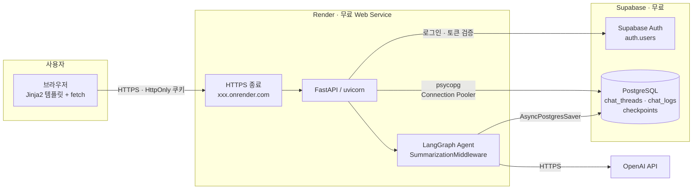
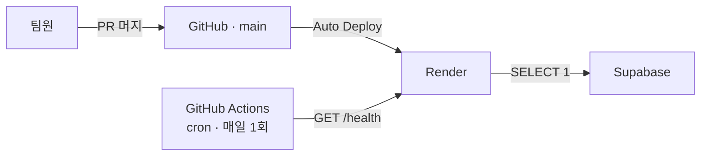
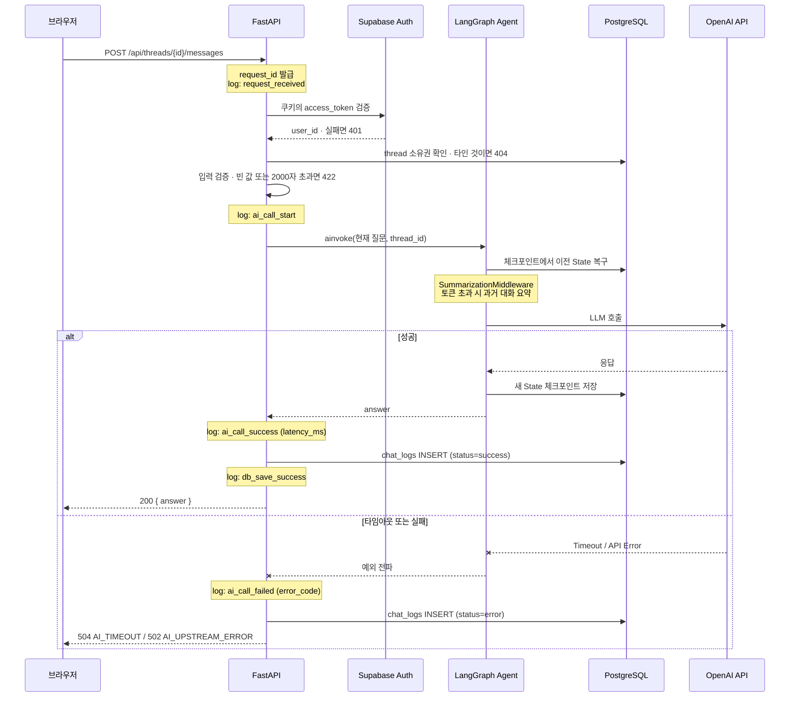
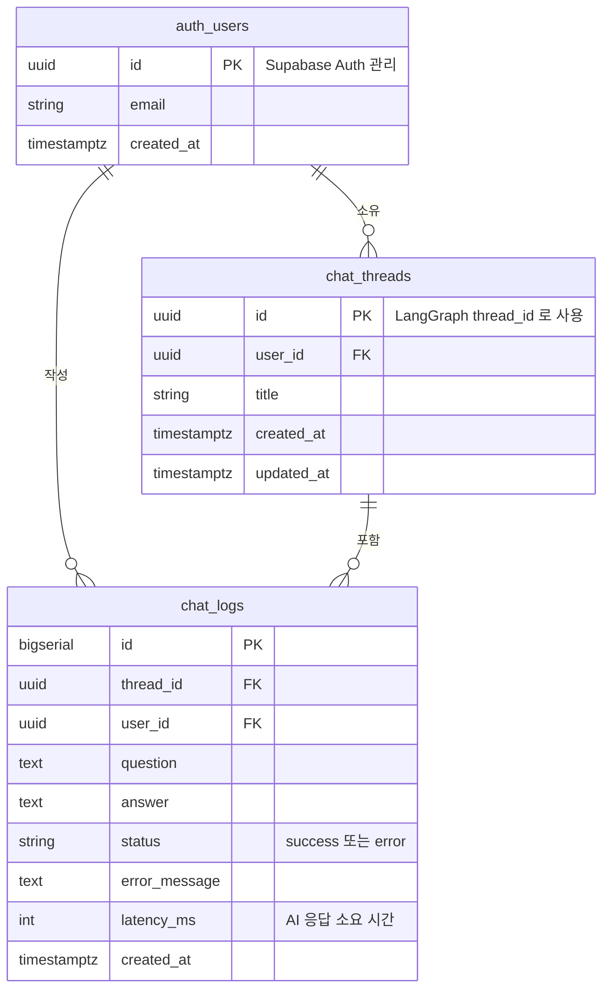

# 시스템 구조

## 1. 배포 구성도



**API 키는 서버에서만 사용한다.** 브라우저는 우리 FastAPI 만 호출하고,
OpenAI 호출과 Supabase 접속은 전적으로 서버 안에서 이루어진다.
Supabase 서비스 키도 클라이언트로 나가지 않는다.

## 2. 배포 파이프라인 및 유휴 방지



무료 플랜에는 유휴 정지 정책이 있어 방치하면 평가 시점에 서비스가 멈출 수 있다.

| 대상 | 정지 조건 | 결과 |
|---|---|---|
| Render | 15분 무활동 | spin down, 다음 요청까지 약 1분 |
| Supabase | **7일 무활동** | **프로젝트 일시정지, 앱 전체 장애** |

`/health` 엔드포인트가 DB에 `SELECT 1`을 던지도록 만들고,
GitHub Actions cron으로 매일 한 번 호출해 양쪽을 함께 깨운다.

## 3. 요청 처리 흐름



**과거 대화를 FastAPI 가 다시 조립하지 않는다.** 같은 `thread_id` 를 넘기면
체크포인터가 이전 State 를 복구한다. `chat_logs` 는 화면 복구와 조회 전용이다.

DB 저장에 실패하더라도 AI 응답을 이미 받았다면 사용자에게는 응답을 반환하고,
저장 실패는 `db_save_failed` 로그로만 남긴다. 사용자 경험을 우선한다.

## 4. 주요 컴포넌트 역할

| 컴포넌트 | 역할 |
|---|---|
| 브라우저 (Jinja2 + JS) | 회원가입 · 로그인 폼, 채팅 화면. `fetch`로 API 호출 |
| 인증 라우터 | 회원가입 · 로그인 · 로그아웃. Supabase Auth 를 호출하고 토큰을 HttpOnly 쿠키로 발급 |
| Supabase Auth | 계정 생성과 자격 증명 검증. 비밀번호 해시를 우리가 보관하지 않는다 |
| `get_current_user` 의존성 | 쿠키의 토큰 검증. 비로그인 요청 401 차단 |
| 스레드 라우터 | 채팅방 생성 · 목록 · 제목 변경 · 삭제. 요청마다 소유권 확인 |
| 챗 라우터 | 입력 검증 → LangGraph 호출 → 응답 반환 → `chat_logs` 저장 |
| LangGraph Agent | `create_agent` 로 구성. 현재 질문만 받아 처리 |
| SummarizationMiddleware | 토큰 임계값 초과 시 과거 대화를 요약으로 압축 |
| AsyncPostgresSaver | `thread_id` 기준 State 저장 · 복구 |
| 로깅 미들웨어 | `request_id` 발급, 요청 · AI 호출 · DB 저장 이벤트 기록 |
| Supabase PostgreSQL | 대화 로그와 체크포인트 영속 저장. 대시보드로 직접 조회 가능 |

## 5. 데이터 모델



`chat_threads.id`가 그대로 LangGraph의 `thread_id`가 된다. 컨텍스트 유지는
체크포인터가 담당하므로 `chat_logs`는 화면 복구와 조회 전용이다.

`chat_logs.user_id`는 조인 없이 사용자 기준으로 로그를 조회하기 위해 비정규화한 컬럼이다.

LangGraph 체크포인트 테이블(`checkpoints` 등)은 위 ERD에 포함하지 않는다.
LangGraph가 자동으로 생성·관리하며 서비스 테이블과 FK를 연결하지 않는다.
자세한 내용은 [API_SPEC.md](./API_SPEC.md) 2.2 참고.

## 6. 환경 변수

값은 `.env`로 관리하며 저장소에 올리지 않는다. 키 목록만 문서화한다.

| 키 | 설명 |
|---|---|
| `OPENAI_API_KEY` | LLM API 인증 키 |
| `MODEL_NAME` | 모델 식별자. 예: `openai:gpt-4.1-mini` |
| `DATABASE_URL` | Supabase PostgreSQL 연결 문자열 (Connection Pooler Session 모드) |
| `SUPABASE_URL` | Supabase 프로젝트 URL |
| `SUPABASE_ANON_KEY` | Supabase Auth 호출용 공개 키 |
| `SUPABASE_SERVICE_ROLE_KEY` | 서버 전용 키. 클라이언트로 내보내지 않는다 |
| `LANGGRAPH_STRICT_MSGPACK` | 체크포인트 역직렬화 타입 제한. `true` |
| `SUMMARY_TRIGGER_TOKENS` | 요약을 시작할 토큰 임계값 (기본 8000) |
| `SUMMARY_KEEP_TOKENS` | 원문으로 유지할 토큰 수 (기본 4000) |
| `AI_TIMEOUT_SECONDS` | AI 호출 타임아웃 |
| `LOG_LEVEL` | 로그 레벨 |

전체 목록과 설명은 [API_SPEC.md](./API_SPEC.md) 13장을 기준으로 한다.

## 7. 다이어그램 이미지

위 다이어그램은 GitHub에서 자동으로 렌더링된다. 발표 자료나 제출 문서처럼
GitHub 밖에서 써야 할 때를 위해 PNG로도 내보내 둔다.

| 파일 | 내용 |
|---|---|
| `docs/images/01-deployment.png` | 배포 구성도 |
| `docs/images/02-pipeline.png` | 배포 파이프라인 및 유휴 방지 |
| `docs/images/03-request-flow.png` | 요청 처리 흐름 |
| `docs/images/04-erd.png` | 데이터 모델 |

원본은 `docs/diagrams/*.mmd`에 있다. 문서를 고친 뒤에는 아래 명령으로 이미지를
다시 만든다. Node.js와 Chrome이 필요하다.

```bash
./scripts/render-diagrams.sh
```
