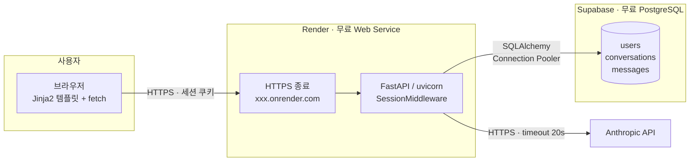
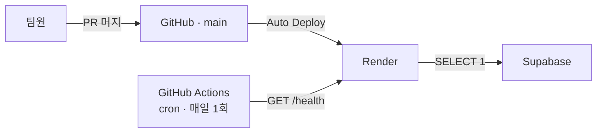
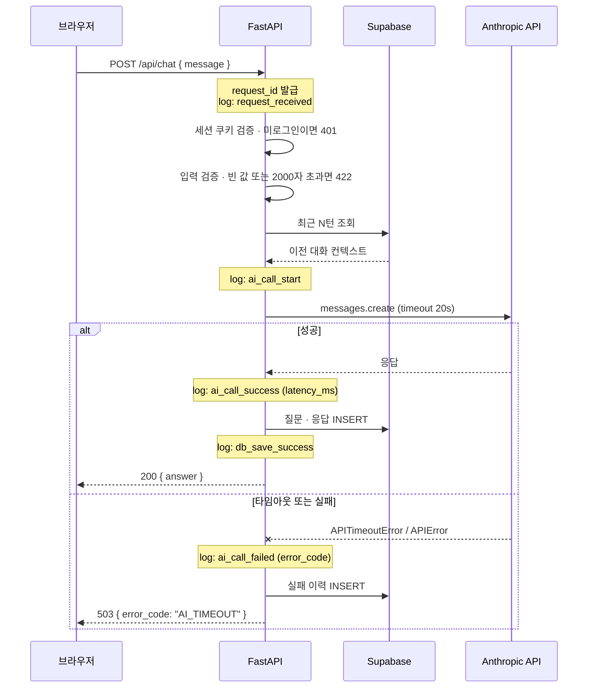
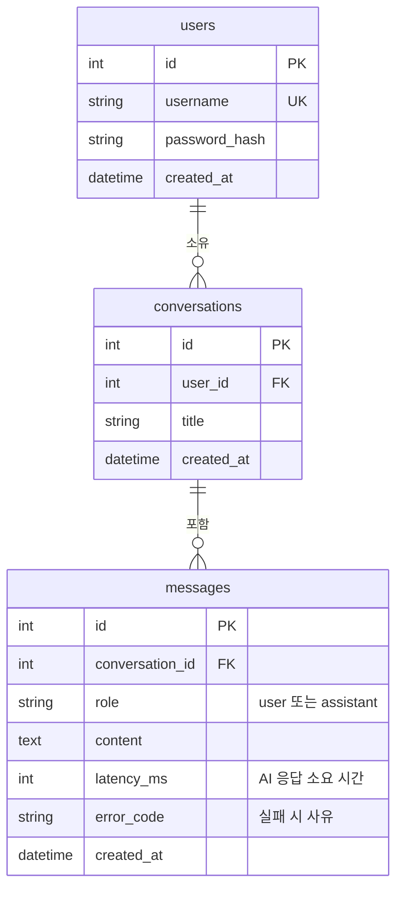

# 시스템 구조

## 1. 배포 구성도



**AI API 키는 서버에서만 사용한다.** 브라우저는 우리 서버(`/api/chat`)만 호출하고,
Anthropic API 호출은 전적으로 FastAPI 안에서 이루어진다. 키가 클라이언트로 나가지 않는다.

## 2. 배포 파이프라인 및 유휴 방지



무료 플랜에는 유휴 정지 정책이 있어 방치하면 평가 시점에 서비스가 멈출 수 있다.

| 대상 | 정지 조건 | 결과 |
|---|---|---|
| Render | 15분 무활동 | spin down, 다음 요청까지 약 1분 |
| Supabase | **7일 무활동** | **프로젝트 일시정지, 앱 전체 장애** |

`/health` 엔드포인트가 DB에 `SELECT 1`을 던지도록 만들고,
GitHub Actions cron으로 매일 한 번 호출해 양쪽을 함께 깨운다.

## 3. 요청 처리 흐름



DB 저장에 실패하더라도 AI 응답을 이미 받았다면 사용자에게는 응답을 반환하고,
저장 실패는 `db_save_failed` 로그로만 남긴다. 사용자 경험을 우선한다.

## 4. 주요 컴포넌트 역할

| 컴포넌트 | 역할 |
|---|---|
| 브라우저 (Jinja2 + JS) | 회원가입 · 로그인 폼, 채팅 화면. `fetch`로 `/api/chat` 호출 |
| SessionMiddleware | 서명된 세션 쿠키 발급 · 검증. 로그인 상태 유지 |
| 인증 라우터 | 회원가입, 로그인, 로그아웃. 비밀번호 bcrypt 해시 |
| `get_current_user` 의존성 | 비로그인 요청 401 차단. 챗 · 로그 조회 API에 적용 |
| 챗 라우터 | 입력 검증 → 컨텍스트 조립 → AI 호출 → 응답 반환 → 로그 저장 |
| AI 클라이언트 | Anthropic API 호출. 타임아웃 및 예외를 사용자 안내로 변환 |
| 로그 라우터 | `GET /api/me/chats` 로 본인 대화 이력 조회 |
| 로깅 미들웨어 | `request_id` 발급, 요청 · AI 호출 · DB 저장 이벤트 기록 |
| Supabase PostgreSQL | 사용자 계정과 대화 로그 영속 저장. 대시보드로 직접 조회 가능 |

## 5. 데이터 모델



`conversations`로 대화를 묶기 때문에 "같은 대화의 최근 N턴"을 컨텍스트로 넘기는 전략이
자연스럽게 구현된다. `latency_ms`와 `error_code`는 운영 지표 및 장애 추적에 사용한다.

## 6. 환경 변수

값은 `.env`로 관리하며 저장소에 올리지 않는다. 키 목록만 문서화한다.

| 키 | 설명 |
|---|---|
| `ANTHROPIC_API_KEY` | AI API 인증 키 |
| `DATABASE_URL` | Supabase PostgreSQL 연결 문자열 (Connection Pooler 사용) |
| `SESSION_SECRET` | 세션 쿠키 서명 키 |
| `AI_MODEL` | 사용할 모델 이름 |
| `AI_TIMEOUT_SECONDS` | AI 호출 타임아웃 (기본 20) |
| `CONTEXT_TURNS` | 컨텍스트로 넘길 직전 대화 수 (기본 10) |
| `LOG_LEVEL` | 로그 레벨 |

## 7. 다이어그램 이미지

위 다이어그램은 GitHub에서 자동으로 렌더링된다. 발표 자료나 제출 문서처럼
GitHub 밖에서 써야 할 때를 위해 PNG로도 내보내 둔다.

| 파일 | 내용 |
|---|---|
| `docs/images/01-deployment.png` | 배포 구성도 |
| `docs/images/02-pipeline.png` | 배포 파이프라인 및 유휴 방지 |
| `docs/images/03-request-flow.png` | 요청 처리 흐름 |
| `docs/images/04-erd.png` | 데이터 모델 |

원본은 `docs/diagrams/*.mmd`에 있다. 문서를 고친 뒤에는 아래 명령으로 이미지를
다시 만든다. Node.js와 Chrome이 필요하다.

```bash
./scripts/render-diagrams.sh
```
